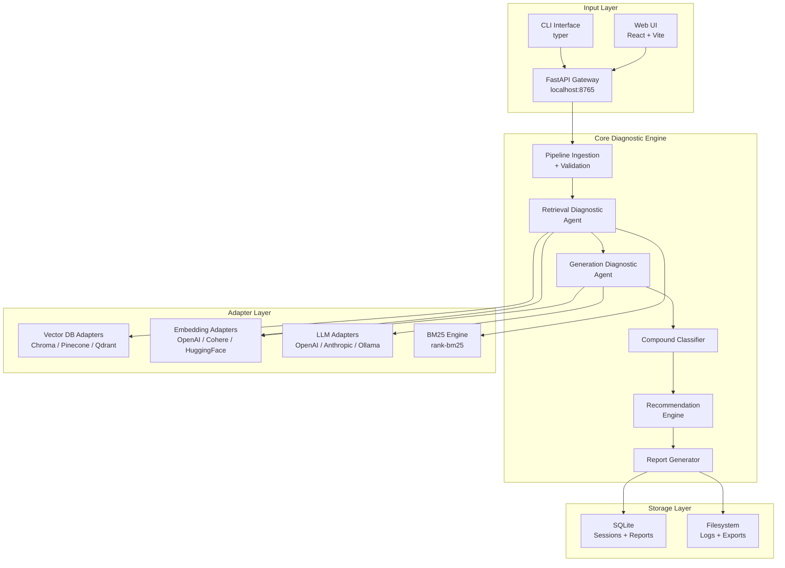
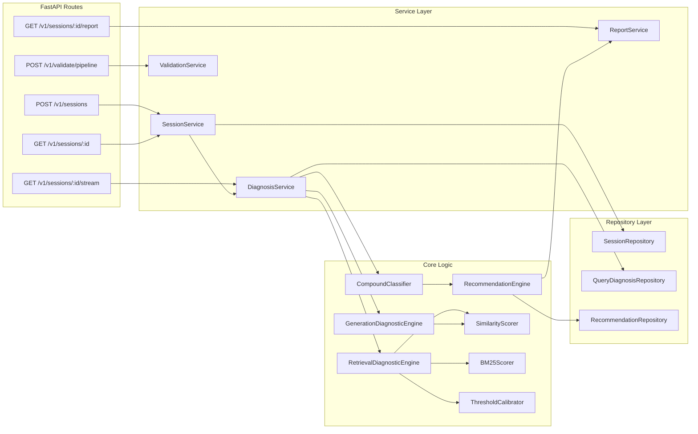
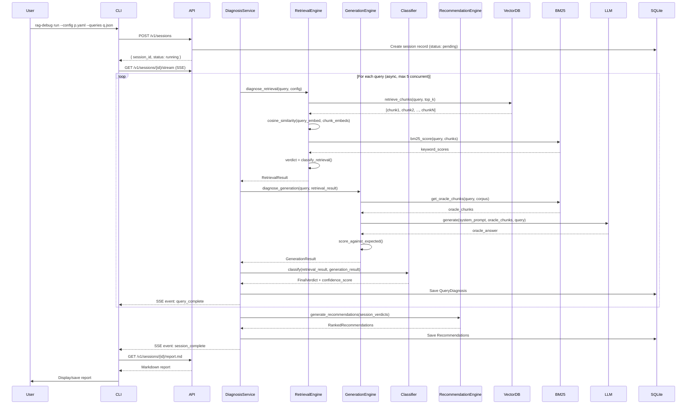
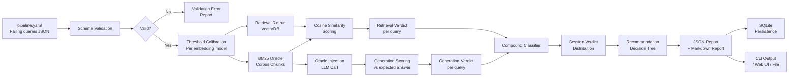
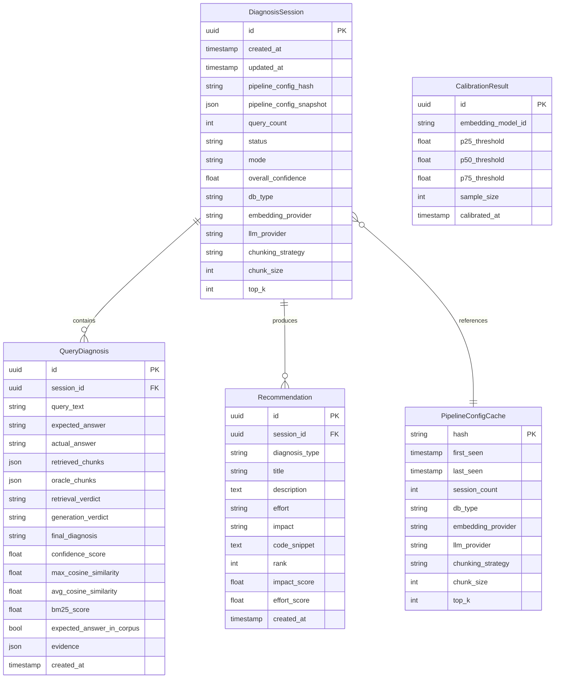
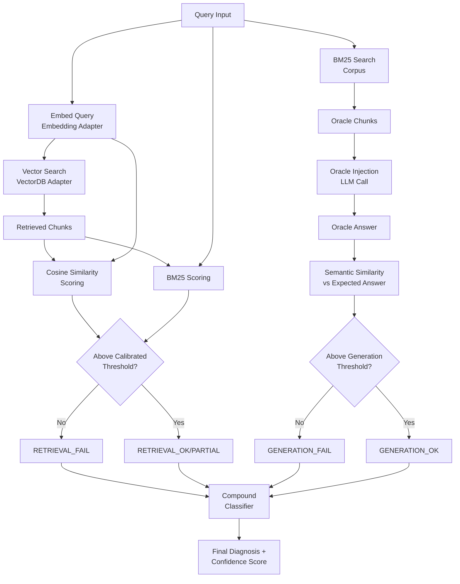
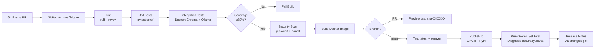

# RAG Quality Debugger Agent
## Complete Project Documentation
**Version:** 1.0.0 | **Status:** Implementation-Ready | **Date:** 2026

---

> **How to use this document:** This is a complete, self-contained project baseline covering all 25 documentation artifacts. Each section can be extracted independently and handed to the relevant team member. All Mermaid diagrams render in GitHub, GitLab, Notion, and any Mermaid-compatible viewer.

---

# Table of Contents

1. [Executive Summary](#1-executive-summary)
2. [Product Requirements Document (PRD)](#2-product-requirements-document)
3. [Software Requirements Specification (SRS)](#3-software-requirements-specification)
4. [System Design Document](#4-system-design-document)
5. [Database Design Document](#5-database-design-document)
6. [API Design Document](#6-api-design-document)
7. [AI/ML Design Document](#7-aiml-design-document)
8. [Security Architecture Document](#8-security-architecture-document)
9. [UI/UX Design Document](#9-uiux-design-document)
10. [Frontend Architecture Document](#10-frontend-architecture-document)
11. [Backend Architecture Document](#11-backend-architecture-document)
12. [DevOps Architecture Document](#12-devops-architecture-document)
13. [Testing Strategy Document](#13-testing-strategy-document)
14. [QA Validation Checklist](#14-qa-validation-checklist)
15. [Risk Assessment Document](#15-risk-assessment-document)
16. [Scalability & Performance Document](#16-scalability--performance-document)
17. [Cost Estimation Document](#17-cost-estimation-document)
18. [Product Roadmap](#18-product-roadmap)
19. [Project Management Plan](#19-project-management-plan)
20. [Deployment Runbook](#20-deployment-runbook)
21. [Maintenance Document](#21-maintenance-document)
22. [Developer Handoff Document](#22-developer-handoff-document)
23. [Investor Pitch Summary](#23-investor-pitch-summary)
24. [Complete Folder Structure](#24-complete-folder-structure)
25. [Implementation Blueprint](#25-implementation-blueprint)
26. [Final Deliverables](#26-final-deliverables)

---

# 1. Executive Summary

## Project Overview

The **RAG Quality Debugger Agent** (codename: `rag-debugger`) is a developer tool that diagnoses failures in Retrieval-Augmented Generation (RAG) pipelines. It accepts a pipeline configuration and a set of failing queries, isolates whether the failure is in the retrieval layer or the generation layer, and produces ranked, evidence-backed recommendations to fix the pipeline.

## Business Problem

RAG pipelines are the dominant architecture for production AI applications in 2026, yet they fail silently and ambiguously. When a user receives a wrong or incomplete answer:

- Engineers cannot determine whether the vector search returned irrelevant chunks (retrieval failure) or whether the LLM synthesized poorly from correct chunks (generation failure)
- Debugging is done by intuition, trial, and error — taking days to resolve issues that have a systematic cause
- Wrong fixes are applied (e.g., switching embedding models when the prompt was the problem), wasting engineering resources and delaying shipping
- No existing tool provides automated, evidence-based failure attribution for RAG pipelines

**Estimated cost of this problem:** 8–15 engineering hours per significant RAG failure, across teams with 2–10 such failures per month.

## Solution

A Python-based agentic diagnostic tool that:

1. Ingests a RAG pipeline config + a list of failing queries
2. Re-runs retrieval and scores chunk relevance using embedding similarity and BM25
3. Runs an oracle injection test to isolate generation failures
4. Classifies each failure as: retrieval failure, generation failure, compound failure, or data quality failure
5. Generates a structured report with ranked, actionable recommendations including code snippets and config diffs

## Value Proposition

| Persona | Before | After |
|---|---|---|
| ML Engineer | 2 days debugging a failing RAG chatbot | 10-minute diagnostic report with exact fix |
| AI Platform Engineer | Manual audit of 6 pipelines quarterly | Automated session-based quality reports |
| Solo AI Founder | Ships broken RAG product, loses users | Catches failures pre-launch with zero ML expertise required |

## Success Metrics

| Metric | Target | Measurement Method |
|---|---|---|
| Diagnosis accuracy | ≥80% correct failure attribution | Validated against 50 hand-labeled golden failures |
| Time to diagnosis | ≤90 seconds for 20 queries | Automated performance test |
| Fix resolution rate | ≥65% of recommendations resolve failure on application | Follow-up session comparison |
| Onboarding time | ≤10 minutes from install to first report | User testing with 5 beta engineers |
| Net Promoter Score | ≥40 among beta users | Post-session survey |

## Expected Outcomes

- **V1 (Local CLI + UI, Month 3):** Adopted by 50+ engineers via GitHub
- **V2 (SaaS Beta, Month 9):** 500 active users, $5K MRR
- **V3 (Scale, Month 18):** 5,000 users, $80K MRR, enterprise contracts

---

# 2. Product Requirements Document

## Vision

To become the standard diagnostic layer for every RAG pipeline in production — the tool engineers reach for before they reach for the debugger.

## Objectives

1. Provide reliable, evidence-backed failure attribution for RAG pipelines
2. Eliminate guesswork from RAG debugging
3. Reduce mean time to fix (MTTF) for RAG failures by 80%
4. Be opinionated enough to help non-experts, transparent enough to be trusted by experts

## Goals

- **G1:** Correctly diagnose retrieval vs. generation failures with ≥80% accuracy
- **G2:** Support the 3 most common vector DBs and 3 most common LLM providers in V1
- **G3:** Generate actionable, ordered recommendations with implementation effort scores
- **G4:** Run entirely locally with no cloud dependency in V1
- **G5:** Produce shareable markdown reports for team communication

## User Personas

### Persona 1: Priya — ML Engineer
- **Age:** 28 | **Role:** ML Engineer at Series B AI startup
- **Technical level:** High (Python, PyTorch, LangChain, Pinecone)
- **Pain:** Gets paged at 2am when the RAG chatbot gives nonsense answers. Spends hours narrowing down whether it's the embeddings or the prompt.
- **Goal:** Run a diagnostic in under 15 minutes and know exactly what to change
- **Quote:** *"I just need something that tells me what's actually broken."*

### Persona 2: Arjun — AI Platform Engineer
- **Age:** 33 | **Role:** Platform Engineer, mid-size enterprise
- **Technical level:** Very high (infrastructure, MLOps, multi-team coordination)
- **Pain:** Maintains a shared RAG platform used by 6 product teams. Quality audits are manual and inconsistent.
- **Goal:** Automated, repeatable quality reports he can share with product managers
- **Quote:** *"I need a way to prove to the product team that the retrieval is the problem, not the model."*

### Persona 3: Dev — Solo AI Founder
- **Age:** 25 | **Role:** Technical founder, pre-seed startup
- **Technical level:** Medium (can write Python, understands RAG conceptually, not an ML expert)
- **Pain:** Building a RAG-powered product but has no ML team. Can't tell if poor answers are a data problem, a chunking problem, or a prompt problem.
- **Goal:** Opinionated recommendations he can implement in an afternoon
- **Quote:** *"Just tell me what to fix. I don't need the theory."*

## User Stories

### Must Have (V1)

| ID | Story | Acceptance Criteria |
|---|---|---|
| US-01 | As Priya, I want to submit my pipeline config and a list of failing queries so I can get a diagnosis without writing any code | Pipeline config validated and session created within 5s of submission |
| US-02 | As Priya, I want the tool to tell me definitively whether retrieval or generation is failing so I don't waste time on the wrong layer | Each query gets a verdict: retrieval_failure / generation_failure / compound_failure / data_quality_failure |
| US-03 | As Arjun, I want to see similarity scores and retrieved chunks in the report so I can verify the diagnosis myself | Report includes raw evidence: chunk texts, similarity scores, BM25 scores, oracle test result |
| US-04 | As Dev, I want ranked recommendations with effort and impact ratings so I know what to fix first | Recommendations ordered by impact/effort ratio; each includes a code snippet or config diff |
| US-05 | As any user, I want a downloadable markdown report so I can share findings with my team | GET /sessions/{id}/report.md returns valid markdown |
| US-06 | As Priya, I want the tool to work without internet if my LLM runs locally so I can use it on sensitive data | All features work with Ollama as the LLM provider; no external calls made |

### Should Have (V1)

| ID | Story |
|---|---|
| US-07 | As Arjun, I want session history so I can compare pipeline quality before and after a fix |
| US-08 | As any user, I want the CLI to validate my config before running a full session |
| US-09 | As Dev, I want the tool to explain why it reached its diagnosis, not just what the diagnosis is |

### Nice to Have (V1.1+)

| ID | Story |
|---|---|
| US-10 | As Priya, I want the tool to run a baseline stress test on random corpus queries, not just my failing set |
| US-11 | As Arjun, I want multi-user support so my team can share a session history |
| US-12 | As any user, I want the tool to detect if my query language doesn't match my corpus language |

## Functional Requirements

| ID | Requirement | Priority |
|---|---|---|
| FR-01 | Accept pipeline config in YAML format with schema validation | Must |
| FR-02 | Accept failing queries as JSON array with optional expected answers | Must |
| FR-03 | Re-run retrieval for each query against live index | Must |
| FR-04 | Score chunk relevance using cosine similarity (embedding-based) | Must |
| FR-05 | Score chunk relevance using BM25 keyword overlap as secondary signal | Must |
| FR-06 | Run oracle injection test using BM25-retrieved oracle chunks | Must |
| FR-07 | Classify failure per query into 5 diagnosis categories | Must |
| FR-08 | Generate ranked recommendations per failure type | Must |
| FR-09 | Produce structured JSON report | Must |
| FR-10 | Produce rendered markdown report | Must |
| FR-11 | Support Chroma, Pinecone, Qdrant as vector DB backends | Must |
| FR-12 | Support OpenAI, Anthropic, Ollama as LLM backends | Must |
| FR-13 | Support OpenAI, Cohere, HuggingFace as embedding backends | Must |
| FR-14 | Persist session history to local SQLite | Must |
| FR-15 | Provide CLI interface with run / report / validate / ui commands | Must |
| FR-16 | Provide local web UI with session setup, progress, and report views | Should |
| FR-17 | Stream real-time progress via Server-Sent Events | Should |
| FR-18 | Detect and reject pickle-format LangChain input with clear error | Must (Security) |
| FR-19 | Provide --redact flag for heuristic PII scrubbing before external calls | Should |
| FR-20 | Resume interrupted sessions from last completed query | Should |

## Non-Functional Requirements

| ID | Requirement | Target |
|---|---|---|
| NFR-01 | Single query diagnosis time (embedding-only) | ≤15 seconds |
| NFR-02 | 20-query batch diagnosis time | ≤90 seconds |
| NFR-03 | CLI startup time | ≤3 seconds |
| NFR-04 | Test coverage on core diagnostic modules | ≥80% |
| NFR-05 | Python version support | 3.10+ |
| NFR-06 | Platform support | macOS, Linux, Windows (WSL2) |
| NFR-07 | Package install size | ≤500MB including ML dependencies |
| NFR-08 | No telemetry without explicit opt-in | Enforced |
| NFR-09 | All API keys handled via env vars or .env, never hardcoded | Enforced |

## Acceptance Criteria

- **AC-01:** `rag-debug run --config pipeline.yaml --queries queries.json` produces a complete report for a 20-query session in ≤90 seconds
- **AC-02:** The oracle injection test produces a different diagnosis than retrieval-only analysis in ≥30% of test cases (validates the test is doing real work)
- **AC-03:** Similarity thresholds are calibrated per embedding model using the lookup table; not a single hardcoded value
- **AC-04:** The tool handles vector DB unreachability gracefully, falling back to static analysis with a clear warning
- **AC-05:** No API keys appear in any log file, report, or error message

## Constraints

- V1 is a local developer tool, not a SaaS product
- No auto-apply of fixes — diagnostic and recommendation only
- No support for non-text modalities (images, tables, audio) in V1
- No real-time continuous monitoring in V1
- Corpus must be pre-indexed; the tool does not perform initial indexing

## Assumptions

| ID | Assumption | Impact if Wrong |
|---|---|---|
| A-01 | Users have an existing, functioning RAG pipeline they want to debug | Core use case changes entirely |
| A-02 | Users can provide at least 3 failing queries per session | Pattern-level recommendations unavailable; tool degrades to per-query mode |
| A-03 | The vector index is accessible for re-running retrieval | Tool degrades to static analysis mode |
| A-04 | Python 3.10+ is available in the user's environment | Installation fails |
| A-05 | LLM-as-judge optional flag means users understand the data sharing implication | Potential enterprise compliance issue |

## Risks

| Risk | Probability | Impact | Mitigation |
|---|---|---|---|
| Misdiagnosis damages user trust | Medium | High | Show confidence scores and raw evidence always; never show diagnoses without evidence |
| Embedding model threshold miscalibration | High | Medium | Per-model threshold lookup table + auto-calibration on unknown models |
| Oracle injection test is unsound (circular) | High | Critical | Oracle chunks sourced from BM25, not from the vector DB being debugged |
| Data privacy violation if chunk content sent externally | Medium | High | LLM-as-judge opt-in with explicit data sharing acknowledgment |

## KPIs

| KPI | V1 Target | V2 Target |
|---|---|---|
| GitHub stars | 500 | 2,000 |
| Weekly active installs (pip) | 100 | 1,000 |
| Diagnosis accuracy (golden set) | 80% | 85% |
| Fix resolution rate | 65% | 75% |
| Mean session duration | <5 min | <5 min |
| NPS | 40 | 50 |

---

# 3. Software Requirements Specification

## 3.1 Introduction

### Purpose
This SRS defines the complete functional and non-functional requirements for the RAG Quality Debugger Agent (rag-debugger), a developer diagnostic tool for RAG pipeline failure analysis.

### Intended Audience
- Backend engineers implementing the system
- QA engineers designing test cases
- Security engineers reviewing threat surface
- DevOps engineers designing deployment infrastructure

### Document Conventions
- **SHALL** — mandatory requirement
- **SHOULD** — recommended requirement
- **MAY** — optional requirement
- **[ASSUMPTION]** — requirement based on an assumption, not explicit user input

## 3.2 Scope

The system accepts a RAG pipeline configuration (YAML) and a set of failing queries (JSON), diagnoses failure modes at the retrieval and generation layers, and produces an evidence-backed report with ranked recommendations. It operates as a local CLI tool with an optional local web UI.

**In scope:** Diagnosis, classification, recommendation, reporting, session persistence, CLI, local web UI
**Out of scope:** Auto-remediation, pipeline indexing, real-time monitoring, multi-tenancy, non-text modalities

## 3.3 Definitions

| Term | Definition |
|---|---|
| RAG | Retrieval-Augmented Generation — a pattern where relevant documents are retrieved and injected into an LLM prompt |
| Chunk | A segment of a document stored in the vector index |
| Embedding | A numerical vector representation of text, used for semantic similarity search |
| Retrieval Layer | The component that fetches relevant chunks from the vector index given a query |
| Generation Layer | The LLM component that synthesizes an answer from the retrieved chunks |
| Oracle Injection | A diagnostic technique where ideal chunks are artificially injected into the generation step to isolate generation failures from retrieval failures |
| BM25 | Best Match 25 — a keyword-based ranking algorithm used as a retrieval-independent oracle |
| Cosine Similarity | A measure of angular similarity between two embedding vectors, range [-1, 1] |
| Session | A single diagnostic run containing one pipeline config and one query set |
| Verdict | The per-query failure classification output by the diagnostic engine |

## 3.4 Stakeholders

| Stakeholder | Role | Interest |
|---|---|---|
| ML Engineers | Primary users | Accurate diagnosis, fast results |
| AI Platform Engineers | Primary users | Batch auditing, shareable reports |
| Solo AI Founders | Primary users | Opinionated recommendations |
| Open Source Community | Contributors | Code quality, extensibility |
| Future Enterprise Customers | Secondary users (V2) | Compliance, multi-user, SLA |

## 3.5 System Features

### SF-01: Pipeline Ingestion
The system SHALL accept a RAG pipeline definition via YAML configuration. The configuration SHALL specify the vector database connection, embedding model, LLM, and chunking strategy. The system SHALL validate the configuration against a JSON Schema and reject invalid configurations with structured error messages.

### SF-02: Query Ingestion
The system SHALL accept a JSON array of failing queries. Each query SHALL contain at minimum a `query` string field. The system SHALL support optional `expected_answer`, `retrieved_chunks`, and `actual_answer` fields. The system SHALL operate in supervised mode when expected answers are provided and unsupervised mode otherwise, and SHALL clearly distinguish between these modes in the report.

### SF-03: Retrieval Diagnostic Engine
The system SHALL re-execute retrieval for each failing query against the configured vector index. The system SHALL compute cosine similarity between the query embedding and each retrieved chunk embedding. The system SHALL compute BM25 keyword overlap scores. The system SHALL check for duplicate chunks in the result set. The system SHALL perform an oracle lookup to confirm whether the expected answer exists in the corpus at all. The system SHALL assign a retrieval verdict per query.

### SF-04: Generation Diagnostic Engine
The system SHALL construct an oracle context using BM25-retrieved chunks (independent of the vector index). The system SHALL run the configured LLM with the oracle context and the pipeline's actual system prompt. The system SHALL score the oracle-context output against the expected answer using semantic similarity and keyword matching. The system SHALL assign a generation verdict per query.

### SF-05: Compound Classifier
The system SHALL combine retrieval and generation verdicts according to the classification matrix defined in the functional requirements. The system SHALL assign a confidence score to each verdict. The system SHALL flag verdicts with confidence < 0.5 as LOW_CONFIDENCE.

### SF-06: Recommendation Engine
The system SHALL generate ranked recommendations based on the aggregate verdict distribution across all queries in a session. Recommendations SHALL be ordered as a decision tree (retrieval fixes first, generation fixes second). Each recommendation SHALL include title, description, effort rating, impact rating, and a code snippet or config diff. The system SHALL not recommend mutually contradictory fixes within the same session.

### SF-07: Report Generation
The system SHALL produce a structured JSON report and a rendered Markdown report. Reports SHALL include per-query diagnosis, aggregate patterns, ranked recommendations, and raw evidence. Reports SHALL be persisted to local storage. Reports SHALL be accessible via CLI and web UI.

### SF-08: Session Management
The system SHALL persist all sessions to a local SQLite database. The system SHALL support session history listing and retrieval. The system SHALL detect if the pipeline configuration has changed between sessions using a configuration hash. The system SHALL support resuming interrupted sessions.

## 3.6 Business Rules

| ID | Rule |
|---|---|
| BR-01 | A session with fewer than 3 failing queries SHALL NOT produce pattern-level recommendations |
| BR-02 | Unsupervised mode reports SHALL be visibly marked with a reduced-confidence warning |
| BR-03 | The tool SHALL NOT modify any user pipeline component — it is read-only |
| BR-04 | Pickle-format inputs SHALL be rejected with a security warning |
| BR-05 | Oracle chunks MUST be sourced from BM25, not from the vector DB being diagnosed |
| BR-06 | LLM-as-judge calls SHALL require explicit opt-in with a data sharing acknowledgment |
| BR-07 | API keys SHALL never appear in any log, report, or error message |
| BR-08 | Confidence scores < 0.5 SHALL display a LOW_CONFIDENCE warning in the report |

## 3.7 Performance Requirements

| Requirement | Target |
|---|---|
| Single query diagnosis (embedding only) | ≤15 seconds |
| Single query diagnosis (with LLM-as-judge) | ≤45 seconds |
| 20-query batch (embedding only) | ≤90 seconds (parallelized) |
| 20-query batch (with LLM-as-judge) | ≤300 seconds |
| Report generation after diagnosis | ≤5 seconds |
| CLI startup | ≤3 seconds |
| Web UI load time | ≤2 seconds |
| Max concurrent query diagnoses | 5 (configurable) |

## 3.8 Reliability Requirements

- Interrupted sessions SHALL be resumable from last completed query
- All completed diagnoses SHALL be persisted before the next query begins
- The system SHALL not produce partial reports silently — any incomplete report SHALL be clearly marked as partial
- External API failures SHALL not crash the session — they SHALL trigger graceful degradation with clear warnings

## 3.9 Security Requirements

- API keys SHALL be accepted via environment variables or .env files only
- The system SHALL detect and reject pickle-format input files
- The system SHALL provide a --redact flag that applies heuristic PII scrubbing before any external API call
- No telemetry SHALL be transmitted without explicit user opt-in
- The system SHALL validate all user-provided config values against a schema before use

## 3.10 Availability Requirements

V1 is a local tool — no uptime SLA. Sessions are stateless relative to external services; the tool will degrade gracefully if external services are unavailable.

## 3.11 Compliance Requirements

V1 has no formal compliance requirements. The --redact flag and LLM-as-judge opt-in are implemented to support users in regulated industries. V2 SaaS will require GDPR and SOC2 consideration.

---

# 4. System Design Document

## 4.1 High-Level Architecture



## 4.2 Low-Level Architecture



## 4.3 Component Breakdown

| Component | Responsibility | Technology |
|---|---|---|
| CLI | User-facing command interface | Python + typer |
| FastAPI Gateway | HTTP API, request validation, SSE streaming | FastAPI + uvicorn |
| SessionService | Create, retrieve, list sessions | Python |
| DiagnosisService | Orchestrate full diagnostic pipeline | Python + asyncio |
| RetrievalDiagnosticEngine | Re-run retrieval, score chunks, detect retrieval failure | Python |
| GenerationDiagnosticEngine | Run oracle injection, score generation output | Python |
| CompoundClassifier | Combine verdicts, compute confidence | Python |
| RecommendationEngine | Generate ordered, non-contradictory recommendations | Python |
| SimilarityScorer | Cosine similarity computation with calibrated thresholds | sentence-transformers |
| BM25Scorer | Keyword relevance scoring, oracle chunk retrieval | rank-bm25 |
| ThresholdCalibrator | Per-model threshold calibration at session start | Python |
| ReportService | Generate JSON and Markdown reports | Python + jinja2 |
| Vector DB Adapters | Abstract interface to Chroma / Pinecone / Qdrant | Per-SDK |
| Embedding Adapters | Abstract interface to embedding providers | Per-SDK |
| LLM Adapters | Abstract interface to LLM providers | Per-SDK |
| SessionRepository | CRUD for DiagnosisSession | SQLAlchemy |
| QueryDiagnosisRepository | CRUD for QueryDiagnosis | SQLAlchemy |

## 4.4 Sequence Diagram — Full Diagnosis Flow



## 4.5 Data Flow Diagram



---

# 5. Database Design Document

## 5.1 Entity Relationship Diagram



## 5.2 SQL Schema

```sql
-- Enable UUID extension (PostgreSQL) or use TEXT for SQLite
CREATE EXTENSION IF NOT EXISTS "uuid-ossp";

-- DiagnosisSession
CREATE TABLE diagnosis_sessions (
    id UUID PRIMARY KEY DEFAULT uuid_generate_v4(),
    created_at TIMESTAMP NOT NULL DEFAULT NOW(),
    updated_at TIMESTAMP NOT NULL DEFAULT NOW(),
    pipeline_config_hash VARCHAR(64) NOT NULL,
    pipeline_config_snapshot JSONB,
    query_count INTEGER NOT NULL DEFAULT 0,
    status VARCHAR(20) NOT NULL DEFAULT 'pending'
        CHECK (status IN ('pending', 'running', 'complete', 'failed', 'partial')),
    mode VARCHAR(20) NOT NULL DEFAULT 'unsupervised'
        CHECK (mode IN ('supervised', 'unsupervised')),
    overall_confidence FLOAT,
    db_type VARCHAR(50),
    embedding_provider VARCHAR(50),
    llm_provider VARCHAR(50),
    chunking_strategy VARCHAR(50),
    chunk_size INTEGER,
    top_k INTEGER,
    CONSTRAINT top_k_range CHECK (top_k BETWEEN 1 AND 50),
    CONSTRAINT chunk_size_range CHECK (chunk_size BETWEEN 64 AND 8192)
);

-- QueryDiagnosis
CREATE TABLE query_diagnoses (
    id UUID PRIMARY KEY DEFAULT uuid_generate_v4(),
    session_id UUID NOT NULL REFERENCES diagnosis_sessions(id) ON DELETE CASCADE,
    query_text TEXT NOT NULL,
    expected_answer TEXT,
    actual_answer TEXT,
    retrieved_chunks JSONB NOT NULL DEFAULT '[]',
    oracle_chunks JSONB,
    retrieval_verdict VARCHAR(30) NOT NULL
        CHECK (retrieval_verdict IN (
            'RETRIEVAL_OK', 'RETRIEVAL_FAIL', 'RETRIEVAL_PARTIAL', 'DATA_MISSING', 'UNKNOWN'
        )),
    generation_verdict VARCHAR(30) NOT NULL
        CHECK (generation_verdict IN (
            'GENERATION_OK', 'GENERATION_FAIL', 'GENERATION_PARTIAL', 'SKIPPED', 'UNKNOWN'
        )),
    final_diagnosis VARCHAR(30) NOT NULL
        CHECK (final_diagnosis IN (
            'retrieval_failure', 'generation_failure', 'compound_failure',
            'data_quality_failure', 'no_failure_detected', 'insufficient_evidence'
        )),
    confidence_score FLOAT NOT NULL
        CHECK (confidence_score BETWEEN 0.0 AND 1.0),
    max_cosine_similarity FLOAT,
    avg_cosine_similarity FLOAT,
    bm25_score FLOAT,
    expected_answer_in_corpus BOOLEAN,
    evidence JSONB NOT NULL DEFAULT '{}',
    created_at TIMESTAMP NOT NULL DEFAULT NOW()
);

-- Recommendations
CREATE TABLE recommendations (
    id UUID PRIMARY KEY DEFAULT uuid_generate_v4(),
    session_id UUID NOT NULL REFERENCES diagnosis_sessions(id) ON DELETE CASCADE,
    diagnosis_type VARCHAR(30) NOT NULL,
    title VARCHAR(200) NOT NULL,
    description TEXT NOT NULL,
    effort VARCHAR(10) NOT NULL CHECK (effort IN ('low', 'medium', 'high')),
    impact VARCHAR(10) NOT NULL CHECK (impact IN ('low', 'medium', 'high')),
    code_snippet TEXT,
    rank INTEGER NOT NULL,
    impact_score FLOAT NOT NULL DEFAULT 0.0,
    effort_score FLOAT NOT NULL DEFAULT 0.0,
    created_at TIMESTAMP NOT NULL DEFAULT NOW()
);

-- PipelineConfigCache
CREATE TABLE pipeline_config_cache (
    hash VARCHAR(64) PRIMARY KEY,
    first_seen TIMESTAMP NOT NULL DEFAULT NOW(),
    last_seen TIMESTAMP NOT NULL DEFAULT NOW(),
    session_count INTEGER NOT NULL DEFAULT 1,
    db_type VARCHAR(50),
    embedding_provider VARCHAR(50),
    llm_provider VARCHAR(50),
    chunking_strategy VARCHAR(50),
    chunk_size INTEGER,
    top_k INTEGER
);

-- CalibrationResults
CREATE TABLE calibration_results (
    id UUID PRIMARY KEY DEFAULT uuid_generate_v4(),
    embedding_model_id VARCHAR(200) NOT NULL,
    p25_threshold FLOAT NOT NULL,
    p50_threshold FLOAT NOT NULL,
    p75_threshold FLOAT NOT NULL,
    sample_size INTEGER NOT NULL,
    calibrated_at TIMESTAMP NOT NULL DEFAULT NOW()
);

-- Indexes
CREATE INDEX idx_query_diagnoses_session_id ON query_diagnoses(session_id);
CREATE INDEX idx_query_diagnoses_final_diagnosis ON query_diagnoses(final_diagnosis);
CREATE INDEX idx_recommendations_session_id ON recommendations(session_id);
CREATE INDEX idx_recommendations_rank ON recommendations(session_id, rank);
CREATE INDEX idx_sessions_created_at ON diagnosis_sessions(created_at DESC);
CREATE INDEX idx_sessions_status ON diagnosis_sessions(status);
CREATE INDEX idx_calibration_model ON calibration_results(embedding_model_id);
```

## 5.3 Indexes and Query Optimization

| Query Pattern | Index Strategy |
|---|---|
| List sessions by date | `idx_sessions_created_at` |
| Get all queries for a session | `idx_query_diagnoses_session_id` |
| Aggregate failure types per session | Covered by session_id index + status index |
| Get ranked recommendations | Composite index on (session_id, rank) |
| Lookup calibration by model | `idx_calibration_model` |
| Check if config hash exists | PK lookup on `pipeline_config_cache` |

## 5.4 Future Expansion

| Future Entity | Purpose |
|---|---|
| `CorpusSnapshot` | Track corpus versions and detect drift between sessions |
| `FixAttempt` | Track whether recommendations were applied and whether they resolved failures |
| `User` | Multi-user support for V2 SaaS |
| `Organization` | Team-level session sharing for enterprise |
| `AlertRule` | Continuous monitoring threshold configuration |

---

# 6. API Design Document

## 6.1 API Overview

**Base URL:** `http://localhost:8765/api/v1`
**Protocol:** HTTP/1.1 + Server-Sent Events for streaming
**Format:** JSON (application/json) for all request/response bodies
**Versioning:** URI path versioning (`/v1/`)
**Auth (V1):** None (local). Auth header reserved for V2: `Authorization: Bearer <token>`

## 6.2 Error Format (Universal)

All errors return this structure:

```json
{
  "error": {
    "code": "PIPELINE_CONFIG_INVALID",
    "message": "Human-readable description of the error",
    "details": {
      "field": "pipeline.vector_db.top_k",
      "constraint": "Must be between 1 and 50",
      "received": 0
    }
  }
}
```

## 6.3 Standard Error Codes

| Code | HTTP Status | Description |
|---|---|---|
| PIPELINE_CONFIG_INVALID | 422 | Config fails schema validation |
| QUERY_LIST_EMPTY | 422 | No queries provided |
| SESSION_NOT_FOUND | 404 | Session ID does not exist |
| VECTOR_DB_UNREACHABLE | 503 | Cannot connect to configured vector DB |
| LLM_API_TIMEOUT | 504 | LLM provider did not respond in time |
| EMBEDDING_API_FAILURE | 503 | Embedding provider returned an error |
| PICKLE_INPUT_REJECTED | 400 | Pickle-format input detected and rejected |
| RATE_LIMIT_EXCEEDED | 429 | Too many sessions created in time window |
| INTERNAL_ERROR | 500 | Unexpected internal error |

## 6.4 Endpoints

---

### POST /v1/sessions

Create a new diagnosis session and begin processing asynchronously.

**Request Body:**
```json
{
  "pipeline_config": {
    "vector_db": {
      "type": "chroma",
      "connection": {
        "host": "localhost",
        "port": 8000,
        "collection_name": "my_docs"
      },
      "top_k": 5,
      "similarity_threshold": 0.65
    },
    "embedding_model": {
      "provider": "openai",
      "model_id": "text-embedding-3-small"
    },
    "llm": {
      "provider": "openai",
      "model_id": "gpt-4o",
      "system_prompt": "You are a helpful assistant...",
      "max_tokens": 512
    },
    "chunking": {
      "strategy": "recursive",
      "chunk_size": 512,
      "chunk_overlap": 64
    }
  },
  "queries": [
    {
      "query": "What is the refund policy?",
      "expected_answer": "Refunds are processed within 5 business days.",
      "retrieved_chunks": [],
      "actual_answer": "I don't have information about refunds."
    }
  ],
  "options": {
    "use_llm_as_judge": false,
    "redact_pii": false,
    "max_concurrent": 5
  }
}
```

**Validation Rules:**
- `pipeline_config` required; must pass JSON Schema validation
- `queries` array required; minimum 1 item, maximum 200 items
- `pipeline_config.vector_db.top_k` must be integer between 1 and 50
- `pipeline_config.chunking.chunk_size` must be integer between 64 and 8192
- `pipeline_config.llm.system_prompt` required; minimum 10 characters
- `queries[*].query` required; minimum 3 characters, maximum 2000 characters
- If `options.use_llm_as_judge` is true, must include acknowledgment field (V1.1)

**Response 202 Accepted:**
```json
{
  "session_id": "f47ac10b-58cc-4372-a567-0e02b2c3d479",
  "status": "running",
  "query_count": 1,
  "mode": "supervised",
  "estimated_duration_seconds": 15,
  "stream_url": "/api/v1/sessions/f47ac10b-58cc-4372-a567-0e02b2c3d479/stream"
}
```

**Error Responses:** 422 (PIPELINE_CONFIG_INVALID), 422 (QUERY_LIST_EMPTY), 503 (VECTOR_DB_UNREACHABLE), 429 (RATE_LIMIT_EXCEEDED)

**Rate Limit:** 10 sessions per hour per IP (V1 local: effectively unlimited)

---

### GET /v1/sessions/{session_id}

Get session status and progress.

**Path Parameters:** `session_id` — UUID

**Response 200:**
```json
{
  "session_id": "f47ac10b-58cc-4372-a567-0e02b2c3d479",
  "status": "complete",
  "mode": "supervised",
  "query_count": 20,
  "completed_queries": 20,
  "created_at": "2026-01-15T10:30:00Z",
  "completed_at": "2026-01-15T10:31:15Z",
  "duration_seconds": 75,
  "pipeline_config_hash": "a3f4b2c1d5e6...",
  "verdict_summary": {
    "retrieval_failure": 12,
    "generation_failure": 4,
    "compound_failure": 2,
    "data_quality_failure": 1,
    "no_failure_detected": 1
  }
}
```

**Error Responses:** 404 (SESSION_NOT_FOUND)

---

### GET /v1/sessions/{session_id}/report

Get the full diagnosis report as JSON.

**Query Parameters:**
- `include_raw_chunks` (boolean, default false) — include full chunk text in response

**Response 200:**
```json
{
  "session_id": "f47ac10b-...",
  "generated_at": "2026-01-15T10:31:20Z",
  "mode": "supervised",
  "overall_confidence": 0.82,
  "verdict_summary": { ... },
  "query_diagnoses": [
    {
      "query": "What is the refund policy?",
      "final_diagnosis": "retrieval_failure",
      "confidence_score": 0.91,
      "retrieval_verdict": "RETRIEVAL_FAIL",
      "generation_verdict": "GENERATION_OK",
      "evidence": {
        "max_cosine_similarity": 0.42,
        "avg_cosine_similarity": 0.31,
        "similarity_threshold": 0.65,
        "bm25_score": 0.18,
        "expected_answer_in_corpus": true,
        "top_chunks": [
          {
            "text": "Our shipping policy covers domestic orders...",
            "cosine_similarity": 0.42,
            "bm25_score": 0.18
          }
        ],
        "oracle_test": {
          "oracle_chunks_found": true,
          "oracle_answer_score": 0.88,
          "conclusion": "LLM can answer correctly given the right chunks"
        }
      }
    }
  ],
  "recommendations": [
    {
      "rank": 1,
      "diagnosis_type": "retrieval_failure",
      "title": "Increase chunk overlap to prevent answer boundary splits",
      "description": "...",
      "effort": "low",
      "impact": "high",
      "code_snippet": "chunk_overlap: 128  # increased from 64"
    }
  ],
  "aggregate_patterns": [
    "60% of failures show low cosine similarity (<0.5) — retrieval layer is underperforming",
    "Oracle injection succeeds in 80% of retrieval failures — generation layer is healthy"
  ]
}
```

---

### GET /v1/sessions/{session_id}/report.md

Get the full diagnosis report as rendered Markdown.

**Response 200:** `Content-Type: text/markdown` — full markdown report

---

### GET /v1/sessions/{session_id}/stream

Server-Sent Events stream for real-time progress.

**Response:** `Content-Type: text/event-stream`

```
event: query_started
data: {"query_index": 0, "query_text": "What is the refund policy?"}

event: query_complete
data: {"query_index": 0, "final_diagnosis": "retrieval_failure", "confidence": 0.91}

event: session_complete
data: {"session_id": "...", "duration_seconds": 75}

event: error
data: {"code": "LLM_API_TIMEOUT", "query_index": 3, "fallback": "continuing_without_llm_judge"}
```

---

### POST /v1/validate/pipeline

Validate a pipeline config without running a session.

**Request Body:** `{ "pipeline_config": { ... } }`

**Response 200:**
```json
{
  "valid": true,
  "errors": [],
  "warnings": [
    {
      "field": "pipeline.vector_db.top_k",
      "message": "top_k=2 is very low; consider increasing to at least 5 for better recall"
    }
  ],
  "connectivity": {
    "vector_db": "reachable",
    "embedding_model": "reachable",
    "llm": "reachable"
  }
}
```

---

### GET /v1/sessions

List all sessions with pagination.

**Query Parameters:**
- `page` (integer, default 1)
- `page_size` (integer, default 20, max 100)
- `status` (string, optional filter)

**Response 200:**
```json
{
  "sessions": [...],
  "total": 47,
  "page": 1,
  "page_size": 20
}
```

---

### DELETE /v1/sessions/{session_id}

Delete a session and all associated data.

**Response 204:** No content

---

# 7. AI/ML Design Document

## 7.1 Overview

The RAG Debugger Agent is itself an AI-augmented system. It uses ML models for diagnosis but must be carefully designed to avoid the exact failure modes it diagnoses in others.

## 7.2 Model Architecture

The system uses three ML components:

### Component 1: Embedding Similarity Scorer
- **Purpose:** Measure semantic relevance between queries and retrieved chunks
- **Model:** Adapter-based — uses the same embedding model as the pipeline being diagnosed (to ensure score comparability) OR a cross-encoder model for independent scoring
- **Approach:** Cosine similarity between query embedding and chunk embeddings
- **Key Design Decision:** Thresholds are per-model, not universal

### Component 2: BM25 Oracle Engine
- **Purpose:** Retrieve oracle chunks independent of the vector DB
- **Model:** BM25 (rank-bm25 library) — purely algorithmic, no ML
- **Input:** Full corpus text (chunked) + query
- **Output:** Top-k chunks by keyword relevance
- **Why BM25 and not another embedding model:** BM25 is the most retrieval-method-independent baseline. Using a different embedding model still biases results if the corpus is poorly suited to semantic embeddings. BM25 is deterministic, explainable, and free.

### Component 3: LLM-as-Judge (Optional)
- **Purpose:** Score LLM output quality against expected answer
- **Model:** A stronger LLM than the one being diagnosed (recommended: GPT-4o or Claude 3.5 Sonnet)
- **Approach:** Prompt the judge LLM to score the answer on: accuracy, completeness, groundedness
- **Output:** Score 0–10 + explanation
- **Risk:** Same LLM as target → invalid judgment. Mitigated by configuration warning.

## 7.3 Inference Pipeline



## 7.4 Threshold Calibration

This is the most critical ML design decision. A single hardcoded threshold (e.g., 0.65) is invalid because similarity score distributions vary dramatically by embedding model.

### Known Model Thresholds (Lookup Table)

| Model | P25 Threshold | P50 Threshold | Recommended Failure Threshold |
|---|---|---|---|
| text-embedding-3-small (OpenAI) | 0.58 | 0.72 | 0.60 |
| text-embedding-3-large (OpenAI) | 0.60 | 0.74 | 0.62 |
| text-embedding-ada-002 (OpenAI) | 0.75 | 0.85 | 0.78 |
| embed-english-v3.0 (Cohere) | 0.55 | 0.70 | 0.57 |
| all-MiniLM-L6-v2 (HuggingFace) | 0.30 | 0.52 | 0.32 |
| bge-large-en-v1.5 (HuggingFace) | 0.68 | 0.80 | 0.70 |

### Auto-Calibration for Unknown Models

For any embedding model not in the lookup table:
1. At session start, sample 10 random queries from the corpus
2. Compute the distribution of cosine similarity scores for their top-1 retrieved chunks
3. Set the failure threshold at the 25th percentile of this distribution
4. Document the auto-calibrated threshold in the report

## 7.5 Evaluation Metrics

| Metric | Description | Target |
|---|---|---|
| Attribution Accuracy | % of diagnoses with correct retrieval/generation attribution (vs golden set) | ≥80% |
| False Positive Rate (Retrieval) | % of healthy retrievals flagged as failing | ≤15% |
| False Negative Rate (Retrieval) | % of failing retrievals missed | ≤10% |
| Oracle Test Sensitivity | % of generation failures caught by oracle injection | ≥75% |
| Recommendation Resolution Rate | % of applied recommendations that resolve the failure | ≥65% |

## 7.6 Evaluation Protocol

**Golden Test Set:** 50 hand-labeled RAG failure scenarios with known correct diagnoses, curated across 5 RAG configurations and 4 failure types. Checked into the repository. Used as a regression suite.

**Evaluation runs:** Triggered on every main branch merge. Results stored in `eval_results/` with timestamp and commit hash.

## 7.7 Drift Detection

Since the tool diagnoses external pipelines (not a continuously trained model), drift affects:
- Embedding model API behavior changes (handled by re-running calibration)
- LLM generation quality changes across API versions (mitigated by always specifying model version in config)
- BM25 corpus changes (detected via corpus hash in session metadata)

## 7.8 Explainability

Every diagnosis includes:
- The similarity scores that triggered the verdict
- The calibrated threshold used
- The oracle injection result
- A plain-language explanation of the reasoning

Example explanation:
> "The query returned chunks with max cosine similarity 0.42, below the calibrated threshold of 0.60 for text-embedding-3-small. However, the oracle injection test — which bypassed the vector search and used BM25-retrieved chunks — produced an answer scoring 0.88 against the expected answer. This confirms the LLM can answer correctly given the right context, isolating the failure to the retrieval layer."

## 7.9 Security Risks (AI-Specific)

| Risk | Description | Mitigation |
|---|---|---|
| Prompt injection via corpus | Malicious content in the corpus could manipulate the LLM-as-judge output | LLM-as-judge is opt-in; judge prompt is hardcoded, not corpus-derived |
| Overconfident misdiagnosis | High confidence scores on wrong diagnoses damage trust | Confidence scores are calibrated against the golden set; reported with evidence always |
| Model version drift | OpenAI or Anthropic deprecates a model version | Pin model versions in config; warn on deprecated model IDs |
| Data exfiltration via LLM calls | Sensitive chunk content sent to external LLM | LLM-as-judge is opt-in with explicit data sharing acknowledgment; --redact flag available |

---

# 8. Security Architecture Document

## 8.1 Threat Model

The RAG Debugger is a local developer tool in V1. The threat surface is limited but non-trivial because:
- It handles user API keys (OpenAI, Pinecone, etc.)
- It may process sensitive document content (corpus chunks)
- It has a local HTTP server (FastAPI) that could be exposed if misconfigured

## 8.2 STRIDE Analysis

| Threat Category | Specific Threat | Likelihood | Impact | Mitigation |
|---|---|---|---|---|
| **Spoofing** | Malicious pipeline config file pointing to an attacker-controlled vector DB | Low | Medium | Config schema validation; no execution of config values as code |
| **Tampering** | Modification of SQLite DB to alter diagnosis history | Low | Low | DB stored in user home dir; checksum verification on report export (V1.1) |
| **Repudiation** | Denial of what diagnosis was produced | Low | Low | Reports are timestamped and include config hash |
| **Information Disclosure** | API keys exposed in logs or error messages | High | Critical | Key scrubbing in all log handlers; regex pattern match for key-shaped strings |
| **Information Disclosure** | Chunk content sent to external LLM without consent | Medium | High | LLM-as-judge is opt-in; explicit data sharing acknowledgment required |
| **Denial of Service** | Large corpus BM25 indexing exhausts memory | Low | Medium | BM25 corpus size limit (configurable, default 100K chunks); streaming indexing |
| **Elevation of Privilege** | Pickle deserialization leading to RCE | Medium | Critical | Pickle input explicitly rejected; magic bytes check |
| **Elevation of Privilege** | Prompt injection via corpus content manipulating LLM-as-judge | Low | Medium | Judge prompt is hardcoded and not corpus-derived |

## 8.3 Authentication Strategy

**V1 (local):** No authentication. The tool runs as the user's local process with the user's privileges.

**V2 (SaaS):** JWT-based authentication with the following design:
- Access token: short-lived (15 minutes), JWT with HS256
- Refresh token: long-lived (7 days), opaque token stored server-side
- Token payload: `{ sub: user_id, org_id, role, iat, exp }`
- Token rotation on refresh

## 8.4 Authorization Strategy

**V1:** Single user, all operations permitted.

**V2 RBAC Model:**

| Role | Permissions |
|---|---|
| Analyst | Create sessions, view own sessions, download reports |
| Admin | All Analyst permissions + view all org sessions, manage API key configs, manage users |
| Viewer | View sessions and reports (read-only) |

## 8.5 Secret Management

```
Priority order for secret resolution:
1. Explicit env var: OPENAI_API_KEY=...
2. .env file in current directory (gitignored)
3. ~/.rag-debugger/.env (user-level config)
4. Error: key not found
```

**Rules:**
- Secrets are NEVER read from the pipeline config YAML — only from env vars
- The config validator actively scans YAML for strings matching common API key patterns and rejects them
- Secrets are NEVER written to any log, report, or error message
- Log handlers include a `SecretScrubber` filter that replaces key-shaped strings with `[REDACTED]`

## 8.6 Data Protection

**In transit:** All external API calls use HTTPS. Local FastAPI server uses HTTP (localhost only — not exposed to network interfaces).

**At rest:** SQLite DB stored in `~/.rag-debugger/db.sqlite`. Pipeline config snapshots are stored in the DB — these may contain sensitive system prompt content. A `--encrypt-db` flag (V1.1) will add SQLCipher encryption.

**PII in chunks:** The `--redact` flag applies these patterns before any external API call:
- Email addresses: `[EMAIL]`
- Phone numbers: `[PHONE]`
- SSNs: `[SSN]`
- Credit card numbers: `[CARD]`
- IP addresses: `[IP]`

This is heuristic-grade, not compliance-grade. Documented clearly.

## 8.7 OWASP Compliance Checklist

| OWASP Top 10 | Relevance | Status |
|---|---|---|
| A01 Broken Access Control | Low (local tool) | N/A V1 / Addressed V2 |
| A02 Cryptographic Failures | Medium (API keys at rest) | Partial — env var protection; DB encryption V1.1 |
| A03 Injection | Low | Config schema validation prevents code injection |
| A04 Insecure Design | Medium | STRIDE analysis completed; oracle BM25 independence enforced |
| A05 Security Misconfiguration | Low | No default credentials; no unnecessary ports |
| A06 Vulnerable Components | Medium | Dependency scanning via `pip-audit` in CI |
| A07 Auth Failures | N/A V1 | Addressed in V2 JWT design |
| A08 Software Integrity | Medium | Pickle rejection; signed releases |
| A09 Logging Failures | Medium | SecretScrubber on all log handlers; structured JSON logging |
| A10 SSRF | Low | Config URLs validated against allowlist; no user-supplied URL fetch |

## 8.8 Security Testing Plan

| Test | Tool | Frequency |
|---|---|---|
| Dependency vulnerability scan | pip-audit | Every CI run |
| Static analysis / linting | bandit (Python SAST) | Every CI run |
| Secret detection in commits | detect-secrets (pre-commit hook) | Every commit |
| Pickle injection attempt | Custom test case | Every CI run |
| API key leakage test | Custom log scraper test | Every CI run |
| Prompt injection in corpus | Golden set of adversarial inputs | Weekly |

---

# 9. UI/UX Design Document

## 9.1 Design Principles

1. **Evidence first.** Never show a verdict without showing the evidence behind it. Engineers don't trust black boxes.
2. **Opinionated but transparent.** Recommendations are ranked and ordered, but the reasoning is always visible.
3. **Scannable.** Busy engineers read reports at speed. Key verdicts and recommendations must be visible without scrolling.
4. **Dark mode native.** Developer tools are used in dark environments. Dark mode is the default.
5. **No UX bloat.** This is a diagnostic tool, not a dashboard product. Every UI element must earn its place.

## 9.2 Design System

**Colors:**

| Token | Light Mode | Dark Mode | Usage |
|---|---|---|---|
| `--bg-primary` | #FFFFFF | #0F1117 | Main background |
| `--bg-secondary` | #F8F9FA | #1A1D27 | Card backgrounds |
| `--bg-tertiary` | #F1F3F5 | #252836 | Input backgrounds |
| `--text-primary` | #1A1D27 | #F8F9FA | Primary text |
| `--text-secondary` | #6C757D | #9AA0B2 | Secondary text |
| `--accent-blue` | #2563EB | #3B82F6 | Actions, links |
| `--status-retrieval` | #DC2626 | #EF4444 | Retrieval failure |
| `--status-generation` | #D97706 | #F59E0B | Generation failure |
| `--status-compound` | #7C3AED | #8B5CF6 | Compound failure |
| `--status-data` | #6B7280 | #9CA3AF | Data quality failure |
| `--status-ok` | #16A34A | #22C55E | No failure / healthy |
| `--status-lowconf` | #B45309 | #D97706 | Low confidence warning |

**Typography:**
- Font family: `JetBrains Mono` for code/scores, `Inter` for prose
- Base size: 14px
- Scale: 12 / 14 / 16 / 20 / 24 / 32px
- Weights: 400 (regular), 500 (medium), 600 (semibold)

**Spacing:** 4px base unit → 4, 8, 12, 16, 24, 32, 48, 64px

**Border radius:** 4px (badges), 8px (cards), 12px (panels)

## 9.3 Navigation Structure

```
/                     → Dashboard (session history)
/session/new          → Session setup wizard
/session/:id          → Active session (live progress)
/session/:id/report   → Full report view
/settings             → API key configuration
```

## 9.4 Screen Descriptions

### Screen 1: Dashboard (`/`)
- Header: "RAG Debugger" logo + "New Session" CTA button
- Session history table: columns → Session ID (truncated), Date, Query Count, Primary Failure Type, Overall Confidence, Status badge
- Empty state: "No sessions yet. Run your first diagnosis →"
- Filter bar: by status, by date range, by failure type

### Screen 2: Session Setup Wizard (`/session/new`)
Three-step wizard:

**Step 1 — Pipeline Config**
- YAML editor (CodeMirror) with syntax highlighting
- "Upload YAML file" drag-and-drop alternative
- "Validate Config" button → inline validation feedback
- Connection test results shown inline (green/red per service)

**Step 2 — Queries**
- JSON editor (CodeMirror) with syntax highlighting
- "Upload JSON file" drag-and-drop alternative
- Query count preview, supervised/unsupervised mode indicator
- Mode explanation tooltip

**Step 3 — Options**
- "Use LLM-as-Judge" toggle with data sharing warning banner when enabled
- "Redact PII" toggle
- Max concurrent queries slider (1–10)
- "Run Diagnosis" CTA

### Screen 3: Active Session (`/session/:id`)
- Progress bar: X/N queries complete
- Live feed of query results as they complete (SSE-powered)
- Per-query result cards as they stream in:
  - Query text
  - Verdict badge (color-coded)
  - Confidence score
  - Collapsible evidence section
- Cancel button

### Screen 4: Report View (`/session/:id/report`)
- **Summary bar (top):** Session metadata, overall confidence, verdict distribution donut chart
- **Aggregate Patterns section:** Plain-language pattern findings
- **Recommendations section:**
  - Ordered by rank
  - Each recommendation: title, effort badge, impact badge, description, code snippet with copy button
  - Visual decision tree showing "fix this first, then this"
- **Per-Query Diagnoses section:**
  - Expandable query cards
  - Each: query text, verdict badge, evidence table (cosine similarity, BM25 score, threshold, oracle result)
  - Low confidence queries visually flagged with warning icon
- **Export bar (sticky bottom):** Download JSON, Download Markdown, Copy session URL

## 9.5 Accessibility Requirements

- WCAG 2.1 AA compliance
- All status colors have a non-color indicator (icon or label) — never color alone
- Keyboard navigation for all interactive elements
- Screen reader labels on all icon-only buttons
- Minimum contrast ratio 4.5:1 for all text
- Focus indicators visible in keyboard mode

## 9.6 Responsive Design Strategy

V1 web UI is optimized for desktop (1280px+) only. Mobile is not a V1 requirement — engineers diagnose pipelines at desks. The layout collapses gracefully to 768px for tablet use.

---

# 10. Frontend Architecture Document

## 10.1 Folder Structure

```
frontend/
├── src/
│   ├── api/
│   │   ├── client.ts          # Axios instance, interceptors, base URL
│   │   ├── sessions.ts        # Session API calls
│   │   ├── reports.ts         # Report API calls
│   │   ├── validation.ts      # Validation API calls
│   │   └── types.ts           # Shared API types (auto-generated from OpenAPI)
│   ├── components/
│   │   ├── ui/                # Primitive components (Button, Badge, Card, etc.)
│   │   ├── report/            # Report-specific components
│   │   │   ├── VerdictBadge.tsx
│   │   │   ├── EvidenceTable.tsx
│   │   │   ├── RecommendationCard.tsx
│   │   │   ├── VerdictDonut.tsx
│   │   │   └── QueryDiagnosisCard.tsx
│   │   ├── session/           # Session setup components
│   │   │   ├── PipelineConfigEditor.tsx
│   │   │   ├── QueryEditor.tsx
│   │   │   └── SessionOptions.tsx
│   │   └── layout/
│   │       ├── Header.tsx
│   │       └── Sidebar.tsx
│   ├── pages/
│   │   ├── Dashboard.tsx
│   │   ├── NewSession.tsx
│   │   ├── ActiveSession.tsx
│   │   ├── ReportView.tsx
│   │   └── Settings.tsx
│   ├── hooks/
│   │   ├── useSession.ts      # Session data fetching + polling
│   │   ├── useSSE.ts          # Server-Sent Events connection
│   │   ├── useReport.ts       # Report data fetching
│   │   └── useSessionForm.ts  # New session form state
│   ├── store/
│   │   ├── sessionStore.ts    # Active session state (Zustand)
│   │   └── settingsStore.ts   # User settings (Zustand + localStorage)
│   ├── utils/
│   │   ├── formatters.ts      # Score formatting, date formatting
│   │   ├── validators.ts      # Client-side YAML/JSON validation
│   │   └── constants.ts       # Threshold colors, verdict labels
│   ├── App.tsx
│   ├── main.tsx
│   └── router.tsx
├── public/
├── index.html
├── vite.config.ts
├── tailwind.config.ts
└── tsconfig.json
```

## 10.2 State Management

**Zustand** for global state — lightweight, no boilerplate, ideal for a small tool.

```typescript
// sessionStore.ts
interface SessionStore {
  activeSessions: Record<string, SessionStatus>;
  setSessionStatus: (id: string, status: SessionStatus) => void;
  addQueryResult: (sessionId: string, result: QueryDiagnosis) => void;
  clearSession: (id: string) => void;
}
```

**React Query (TanStack Query)** for server state — caching, refetching, loading states for all API calls.

**Local component state** (useState) for form state, UI state (collapsed/expanded), tab state.

## 10.3 Routing Strategy

React Router v6 with file-based conventions.

```typescript
// router.tsx
const router = createBrowserRouter([
  { path: "/", element: <Dashboard /> },
  { path: "/session/new", element: <NewSession /> },
  { path: "/session/:id", element: <ActiveSession /> },
  { path: "/session/:id/report", element: <ReportView /> },
  { path: "/settings", element: <Settings /> },
]);
```

## 10.4 API Layer

```typescript
// api/client.ts
const apiClient = axios.create({
  baseURL: "http://localhost:8765/api/v1",
  timeout: 10000,
});

// Request interceptor: add auth header (no-op in V1, ready for V2)
apiClient.interceptors.request.use((config) => {
  const token = getAuthToken(); // returns null in V1
  if (token) config.headers.Authorization = `Bearer ${token}`;
  return config;
});

// Response interceptor: normalize errors
apiClient.interceptors.response.use(
  (response) => response.data,
  (error) => {
    const apiError = error.response?.data?.error;
    throw new ApiError(apiError?.code, apiError?.message, apiError?.details);
  }
);
```

## 10.5 SSE Hook

```typescript
// hooks/useSSE.ts
export function useSSE(sessionId: string, onEvent: (event: SSEEvent) => void) {
  useEffect(() => {
    const es = new EventSource(
      `http://localhost:8765/api/v1/sessions/${sessionId}/stream`
    );
    es.addEventListener("query_complete", (e) =>
      onEvent({ type: "query_complete", data: JSON.parse(e.data) })
    );
    es.addEventListener("session_complete", (e) =>
      onEvent({ type: "session_complete", data: JSON.parse(e.data) })
    );
    es.addEventListener("error", (e) =>
      onEvent({ type: "error", data: JSON.parse((e as MessageEvent).data) })
    );
    return () => es.close();
  }, [sessionId]);
}
```

## 10.6 Performance Optimization

- **Code splitting:** Each route is lazy-loaded (`React.lazy`)
- **Virtualization:** Query diagnosis list uses `react-window` for sessions with >50 queries
- **Memoization:** `RecommendationCard` and `QueryDiagnosisCard` are memoized with `React.memo`
- **Bundle size:** CodeMirror (YAML/JSON editor) is imported only on the NewSession page

---

# 11. Backend Architecture Document

## 11.1 Folder Structure

```
backend/
├── api/
│   ├── routes/
│   │   ├── sessions.py        # POST /sessions, GET /sessions, DELETE /sessions/:id
│   │   ├── reports.py         # GET /sessions/:id/report, GET /sessions/:id/report.md
│   │   ├── stream.py          # GET /sessions/:id/stream (SSE)
│   │   └── validate.py        # POST /validate/pipeline
│   ├── middleware/
│   │   ├── logging.py         # Request/response logging with secret scrubbing
│   │   ├── error_handler.py   # Global exception → structured error response
│   │   └── rate_limiter.py    # IP-based rate limiting (V2)
│   └── dependencies.py        # FastAPI dependency injection (DB session, config)
├── core/
│   ├── retrieval_diagnostics.py   # RetrievalDiagnosticEngine
│   ├── generation_diagnostics.py  # GenerationDiagnosticEngine
│   ├── compound_classifier.py     # CompoundClassifier
│   ├── recommendation_engine.py   # RecommendationEngine
│   ├── similarity_scorer.py       # SimilarityScorer + ThresholdCalibrator
│   ├── bm25_engine.py             # BM25Scorer
│   └── report_generator.py        # JSON + Markdown report generation
├── adapters/
│   ├── base.py                # Abstract base classes
│   ├── retrievers/
│   │   ├── chroma_adapter.py
│   │   ├── pinecone_adapter.py
│   │   └── qdrant_adapter.py
│   ├── embeddings/
│   │   ├── openai_embed.py
│   │   ├── cohere_embed.py
│   │   └── hf_embed.py
│   └── llms/
│       ├── openai_llm.py
│       ├── anthropic_llm.py
│       └── ollama_llm.py
├── models/
│   ├── session.py             # Pydantic models: DiagnosisSession, SessionCreate
│   ├── query.py               # QueryDiagnosis, QueryInput
│   ├── report.py              # Report, Recommendation
│   └── config.py              # PipelineConfig schema + validators
├── services/
│   ├── session_service.py     # Session lifecycle management
│   ├── diagnosis_service.py   # Orchestrate full diagnostic pipeline
│   └── report_service.py      # Report retrieval and formatting
├── db/
│   ├── database.py            # SQLAlchemy engine + session factory
│   ├── repositories/
│   │   ├── session_repo.py
│   │   ├── query_repo.py
│   │   └── recommendation_repo.py
│   └── migrations/            # Alembic migration scripts
├── security/
│   ├── secret_manager.py      # Env var resolution, key validation
│   ├── secret_scrubber.py     # Log filter for API key patterns
│   ├── pii_redactor.py        # --redact flag implementation
│   └── pickle_detector.py     # Pickle file rejection
├── config.py                  # Application settings (pydantic-settings)
├── main.py                    # FastAPI app factory
└── cli.py                     # typer CLI entry point
```

## 11.2 Service Layer

```python
# services/diagnosis_service.py

class DiagnosisService:
    def __init__(
        self,
        retrieval_engine: RetrievalDiagnosticEngine,
        generation_engine: GenerationDiagnosticEngine,
        classifier: CompoundClassifier,
        recommendation_engine: RecommendationEngine,
        session_repo: SessionRepository,
        query_repo: QueryDiagnosisRepository,
    ):
        ...

    async def run_session(self, session_id: UUID, config: PipelineConfig, queries: list[QueryInput]) -> None:
        """Orchestrate full diagnostic pipeline for a session."""
        await self.session_repo.update_status(session_id, "running")
        
        # Calibrate thresholds for this embedding model
        threshold = await self.retrieval_engine.calibrate_threshold(config)
        
        # Process queries with bounded concurrency
        semaphore = asyncio.Semaphore(config.options.max_concurrent)
        tasks = [
            self._diagnose_query(session_id, query, config, threshold, semaphore)
            for query in queries
        ]
        await asyncio.gather(*tasks, return_exceptions=True)
        
        # Generate session-level recommendations
        verdicts = await self.query_repo.get_verdicts(session_id)
        recommendations = self.recommendation_engine.generate(verdicts, config)
        await self.recommendation_repo.save_all(session_id, recommendations)
        
        await self.session_repo.update_status(session_id, "complete")
```

## 11.3 Adapter Interface

```python
# adapters/base.py

from abc import ABC, abstractmethod

class RetrieverAdapter(ABC):
    @abstractmethod
    async def retrieve(self, query_embedding: list[float], top_k: int) -> list[Chunk]:
        """Retrieve top_k chunks for a query embedding."""
        ...
    
    @abstractmethod
    async def health_check(self) -> bool:
        """Verify connectivity to the vector DB."""
        ...

class EmbeddingAdapter(ABC):
    @abstractmethod
    async def embed(self, texts: list[str]) -> list[list[float]]:
        """Embed a list of texts into vectors."""
        ...
    
    @property
    @abstractmethod
    def model_id(self) -> str:
        """Return the model identifier for threshold lookup."""
        ...

class LLMAdapter(ABC):
    @abstractmethod
    async def generate(
        self,
        system_prompt: str,
        context: str,
        query: str,
        max_tokens: int
    ) -> str:
        """Generate a response given a system prompt, context, and query."""
        ...
```

## 11.4 Logging Strategy

```python
# middleware/logging.py

import logging
import json
from security.secret_scrubber import SecretScrubber

# All loggers output structured JSON
logging.basicConfig(
    format='%(message)s',
    level=logging.INFO
)

class StructuredFormatter(logging.Formatter):
    def format(self, record):
        log_obj = {
            "timestamp": self.formatTime(record),
            "level": record.levelname,
            "logger": record.name,
            "message": record.getMessage(),
            "session_id": getattr(record, "session_id", None),
        }
        return SecretScrubber.scrub(json.dumps(log_obj))
```

**Log levels by component:**

| Component | Default Level | Verbose Level |
|---|---|---|
| API Gateway | INFO (requests/responses) | DEBUG (headers) |
| DiagnosisService | INFO (session lifecycle) | DEBUG (per-query) |
| RetrieverAdapter | WARNING (failures only) | DEBUG (all calls) |
| LLMAdapter | WARNING (failures only) | DEBUG (prompts/responses) |
| DB Repositories | WARNING (failures only) | DEBUG (queries) |

## 11.5 Error Handling

All exceptions are caught in `middleware/error_handler.py` and transformed into structured error responses. Internal errors never expose stack traces to the API response. Stack traces are logged at ERROR level.

```python
@app.exception_handler(Exception)
async def global_exception_handler(request: Request, exc: Exception):
    logger.error("Unhandled exception", exc_info=exc, extra={"path": request.url.path})
    return JSONResponse(
        status_code=500,
        content={"error": {"code": "INTERNAL_ERROR", "message": "An unexpected error occurred."}}
    )
```

---

# 12. DevOps Architecture Document

## 12.1 CI/CD Pipeline



## 12.2 Git Strategy

**Branching Model:** GitHub Flow (simple, appropriate for a small tool)

```
main                → always deployable; protected branch
feature/FR-xxx      → feature branches; PR required to merge
fix/BUG-xxx         → bug fix branches
release/v1.x.x      → release branches for version bumps
```

**Commit Convention:** Conventional Commits
```
feat(retrieval): add BM25 oracle chunk retrieval
fix(classifier): correct compound failure logic for partial retrieval
docs: update API endpoint documentation
test(golden-set): add 10 generation failure scenarios
chore: bump rank-bm25 to 0.2.3
```

**Branch Protection Rules:**
- Require PR with at least 1 approval to merge to main
- Require status checks to pass (lint, test, coverage)
- No force push to main

## 12.3 Docker Configuration

```dockerfile
# Dockerfile
FROM python:3.11-slim

WORKDIR /app

# Install dependencies first (cache layer)
COPY requirements.txt .
RUN pip install --no-cache-dir -r requirements.txt

# Copy source
COPY backend/ ./backend/
COPY cli/ ./cli/

# Create non-root user
RUN adduser --disabled-password --gecos '' appuser
USER appuser

EXPOSE 8765

CMD ["uvicorn", "backend.main:app", "--host", "0.0.0.0", "--port", "8765"]
```

```yaml
# docker-compose.yml
services:
  rag-debugger:
    build: .
    ports:
      - "8765:8765"
    volumes:
      - ~/.rag-debugger:/home/appuser/.rag-debugger
    env_file:
      - .env

  # Development only — local Chroma for integration tests
  chroma:
    image: chromadb/chroma:latest
    ports:
      - "8000:8000"
    profiles: ["dev"]

  # Development only — local Ollama for integration tests
  ollama:
    image: ollama/ollama:latest
    ports:
      - "11434:11434"
    profiles: ["dev"]
```

## 12.4 Infrastructure Requirements

**V1 (local):** User's machine. Minimum specs: 4GB RAM, Python 3.10+, internet access (for non-Ollama LLM providers)

**V2 (cloud):**

| Component | Service | Sizing |
|---|---|---|
| API Server | Cloud Run (GCP) | 2 vCPU, 4GB RAM, auto-scaling 0→10 |
| Database | Cloud SQL (PostgreSQL 15) | db-f1-micro (MVP), db-n1-standard-2 (scale) |
| Frontend | Vercel | Free tier → Pro at scale |
| Secrets | Secret Manager (GCP) | Per-secret pricing |
| Container Registry | GHCR | Free for public; $0 for GitHub Pro |

## 12.5 Monitoring & Alerting

**V1 (local):** Structured JSON logs to `~/.rag-debugger/logs/`. No external monitoring.

**V2:**

| Signal | Tool | Alert Condition |
|---|---|---|
| API error rate | Cloud Monitoring | >5% 5xx over 5 minutes |
| Diagnosis latency | Cloud Monitoring | p95 >120s for 20-query session |
| DB connection failures | Cloud Monitoring | >0 over 1 minute |
| Evaluation accuracy | Custom metric | <75% on weekly golden set run |
| Dependency vulnerabilities | pip-audit in CI | Any HIGH or CRITICAL |

## 12.6 Backup Strategy

**V1:** SQLite DB at `~/.rag-debugger/db.sqlite`. User-managed. Documentation recommends periodic manual backup.

**V2:** Cloud SQL automated backups — daily snapshot, 7-day retention. Point-in-time recovery enabled.

## 12.7 Disaster Recovery

**V2 RTO/RPO targets:**
- RTO (Recovery Time Objective): 1 hour
- RPO (Recovery Point Objective): 24 hours (daily backup)

**Recovery runbook:** Restore from latest Cloud SQL backup → redeploy Cloud Run service from last known-good container tag → verify with smoke test suite.

---

# 13. Testing Strategy Document

## 13.1 Testing Pyramid

```
         /\
        /E2E\      10% — Cypress; full session flow via web UI
       /------\
      / Integ  \   20% — Real adapters (local Chroma + Ollama)
     /----------\
    /    Unit    \  70% — All core logic mocked; pytest
   /--------------\
```

## 13.2 Unit Tests

**Framework:** pytest + pytest-asyncio

**Coverage target:** ≥80% on all modules in `backend/core/`

**Key test suites:**

| Suite | File | Key Scenarios |
|---|---|---|
| Retrieval diagnostics | `test_retrieval_diagnostics.py` | High similarity (OK), low similarity (FAIL), duplicate chunks, DATA_MISSING |
| Generation diagnostics | `test_generation_diagnostics.py` | Oracle succeeds + original fails (RETRIEVAL_FAIL), oracle fails (GENERATION_FAIL) |
| Compound classifier | `test_compound_classifier.py` | All 7 verdict combinations from the classification matrix |
| Recommendation engine | `test_recommendation_engine.py` | No contradictory recommendations, decision tree ordering, minimum 3 query rule |
| Threshold calibrator | `test_threshold_calibrator.py` | Known models use lookup table, unknown model auto-calibrates |
| BM25 engine | `test_bm25_engine.py` | Correct chunk retrieval, empty corpus, multilingual query |
| Secret scrubber | `test_secret_scrubber.py` | OpenAI key format, Anthropic key format, Pinecone key format |
| Pickle detector | `test_pickle_detector.py` | Real pickle file rejected, YAML file accepted |
| Config validator | `test_config_validator.py` | All invalid config scenarios, API key in YAML rejected |

## 13.3 Integration Tests

Run against real local services (Docker Compose dev profile):

| Test | Services Required |
|---|---|
| Full session with Chroma + OpenAI | Chroma (local), OpenAI API |
| Full session with Ollama (no external calls) | Chroma (local), Ollama (local) |
| Session resume after interruption | Any |
| Vector DB unreachable fallback | Any (DB stopped mid-run) |
| Calibration on unknown embedding model | Any |

## 13.4 Golden Set Tests

50 hand-labeled RAG failure scenarios stored in `tests/golden_set/`:

```json
{
  "id": "GS-001",
  "description": "Low top_k misses relevant chunks — retrieval failure",
  "pipeline_config": { "top_k": 1, "embedding_model": "text-embedding-3-small", ... },
  "queries": [...],
  "expected_diagnoses": ["retrieval_failure", "retrieval_failure", "retrieval_failure"],
  "expected_primary_recommendation": "increase_top_k"
}
```

Distribution of golden set:
- 20 × retrieval failures (various causes)
- 15 × generation failures (prompt issues, model issues)
- 8 × compound failures
- 4 × data quality failures
- 3 × no failure (should not be misdiagnosed)

## 13.5 API Tests

**Framework:** pytest + httpx (async HTTP client)

All endpoints tested for:
- Happy path
- Validation errors (each field)
- Missing required fields
- Invalid types
- Boundary values (top_k=1, top_k=50, top_k=0, top_k=51)
- Service unavailability (mocked adapter failures)

## 13.6 E2E Tests

**Framework:** Playwright

| Scenario | Steps |
|---|---|
| Full new session flow | Load UI → Upload config → Upload queries → Run → Wait for completion → View report → Download markdown |
| Session history | Complete session → Return to dashboard → Session appears in list |
| Config validation | Enter invalid YAML → Click validate → See inline error |
| SSE streaming | Start session → Verify query result cards appear in real time |

## 13.7 Security Tests

| Test | Method | Tool |
|---|---|---|
| API key not in logs | Run session, scan all log files for key patterns | Custom script |
| Pickle file rejected | Submit pickle file as pipeline config | pytest |
| YAML injection | Submit YAML with Python tag (e.g. `!!python/object`) | pytest |
| PII scrubbing | Submit chunk with email/phone, verify redacted in LLM call | pytest |

## 13.8 Performance Tests

**Framework:** locust

| Scenario | Load | Target |
|---|---|---|
| Single session (20 queries, embedding only) | 1 user | ≤90 seconds |
| Concurrent sessions | 5 sessions simultaneously | Each ≤120 seconds |
| Report retrieval | 100 rps | p95 ≤200ms |
| SSE stream | 10 concurrent streams | No dropped events |

## 13.9 Test Matrix

| Component | Unit | Integration | Golden Set | API | E2E | Security | Perf |
|---|---|---|---|---|---|---|---|
| RetrievalDiagnosticEngine | ✅ | ✅ | ✅ | - | - | - | - |
| GenerationDiagnosticEngine | ✅ | ✅ | ✅ | - | - | - | - |
| CompoundClassifier | ✅ | - | ✅ | - | - | - | - |
| RecommendationEngine | ✅ | - | ✅ | - | - | - | - |
| ThresholdCalibrator | ✅ | ✅ | - | - | - | - | - |
| BM25Engine | ✅ | - | - | - | - | - | - |
| VectorDB Adapters | ✅ | ✅ | - | - | - | - | - |
| API Endpoints | - | - | - | ✅ | - | - | ✅ |
| Session Flow | - | - | - | - | ✅ | - | - |
| Secret Management | ✅ | - | - | - | - | ✅ | - |
| Pickle Detection | ✅ | - | - | - | - | ✅ | - |

---

# 14. QA Validation Checklist

## 14.1 Backend Checklist

- [ ] All API endpoints return correct HTTP status codes
- [ ] All validation errors return structured error objects with specific field information
- [ ] Session persisted to DB before any diagnosis begins
- [ ] Session status updated atomically (no partial state)
- [ ] Interrupted sessions marked as "partial" not "complete"
- [ ] Completed query diagnoses saved before moving to next query
- [ ] BM25 engine used for oracle (never the vector DB)
- [ ] Threshold calibration runs before first query diagnosis
- [ ] Unknown embedding models trigger auto-calibration
- [ ] Known embedding models use lookup table thresholds
- [ ] Recommendations do not include contradictory fixes
- [ ] Recommendations ordered by decision tree (retrieval before generation)
- [ ] Minimum 3 query rule enforced for pattern-level recommendations
- [ ] Sessions with <3 queries produce per-query diagnosis only with warning
- [ ] Unsupervised mode reports contain UNSUPERVISED MODE banner
- [ ] LLM-as-judge disabled by default
- [ ] --redact flag applies all 5 PII patterns before external calls
- [ ] Pickle files rejected with descriptive error
- [ ] API keys do not appear in any log output
- [ ] API keys do not appear in any report
- [ ] API keys do not appear in any error message
- [ ] Vector DB unreachable → graceful fallback to static analysis with warning
- [ ] LLM API timeout → single retry then skip with warning, session continues
- [ ] Embedding API failure → session aborts with clear error (not silent)
- [ ] Report generation completes in ≤5 seconds
- [ ] Markdown report is valid markdown (test with markdownlint)
- [ ] JSON report validates against the report schema

## 14.2 Frontend Checklist

- [ ] YAML editor syntax highlighting works
- [ ] Config validation results shown inline, not in alert box
- [ ] JSON query editor validates JSON structure on change
- [ ] Supervised/unsupervised mode indicator updates when expected answers added/removed
- [ ] SSE connection established within 2 seconds of session start
- [ ] Query result cards appear in real time as SSE events arrive
- [ ] SSE connection recovers on disconnect (3 retries with backoff)
- [ ] Low confidence verdicts show warning icon
- [ ] No failure detected verdicts show cautionary text, not green checkmark
- [ ] Recommendation code snippets have working copy button
- [ ] Verdict donut chart renders correctly for all-same-type sessions
- [ ] Session history table is sortable
- [ ] Empty state shown correctly when no sessions exist
- [ ] Download JSON produces valid JSON
- [ ] Download Markdown produces valid Markdown
- [ ] Dark mode: all text readable at 4.5:1 contrast minimum
- [ ] Keyboard navigation works on all interactive elements
- [ ] Report view accessible at 768px (tablet) without horizontal scroll

## 14.3 API Checklist

- [ ] POST /v1/sessions returns 202, not 200
- [ ] GET /v1/sessions/:id/stream returns text/event-stream content type
- [ ] GET /v1/sessions/:id/report.md returns text/markdown content type
- [ ] DELETE /v1/sessions/:id returns 204 with no body
- [ ] POST /v1/validate/pipeline returns connectivity test results
- [ ] All 422 errors include the specific field and constraint that failed
- [ ] 404 returned for non-existent session IDs (not 500)
- [ ] Pagination works correctly on GET /v1/sessions
- [ ] Session stream closes after session_complete event

## 14.4 Database Checklist

- [ ] All CHECK constraints enforced (top_k range, chunk_size range, status enum)
- [ ] Cascade delete: deleting a session deletes all query diagnoses and recommendations
- [ ] Indexes exist and are used for common query patterns (verify with EXPLAIN)
- [ ] Alembic migrations apply cleanly on fresh SQLite DB
- [ ] Alembic downgrade migrations work without data loss
- [ ] config_hash stored correctly (64-char hex SHA-256)
- [ ] JSONB fields store valid JSON (not string-encoded JSON)

## 14.5 AI Features Checklist

- [ ] Retrieval verdict matches expected for all 50 golden set scenarios
- [ ] Generation verdict matches expected for all 50 golden set scenarios
- [ ] Overall attribution accuracy ≥80% on golden set
- [ ] Confidence scores correlate with actual accuracy (higher confidence = higher accuracy)
- [ ] Auto-calibration produces thresholds within ±0.1 of lookup table values for known models
- [ ] BM25 oracle retrieves the expected answer chunk in ≥70% of supervised test cases
- [ ] Recommendation priority order is correct (retrieval fixes before generation fixes)
- [ ] "Brittle pipeline" detection fires when both original and oracle succeed

## 14.6 Security Checklist

- [ ] Pickle file (any magic bytes 80 02 - 80 05) rejected at API layer
- [ ] YAML with `!!python/object` tag rejected by schema validator
- [ ] API key patterns (sk-..., pk-..., Bearer ...) not in log files after test run
- [ ] API key patterns not in report output after test run
- [ ] --redact flag scrubs email from chunk before LLM-as-judge call
- [ ] --redact flag scrubs SSN pattern from chunk before LLM-as-judge call
- [ ] pip-audit reports no HIGH or CRITICAL vulnerabilities
- [ ] bandit static analysis reports no HIGH severity issues
- [ ] detect-secrets pre-commit hook blocks commits with secret patterns

---

# 15. Risk Assessment Document

## 15.1 Risk Matrix

```
         Impact
         Low        Medium       High       Critical
Prob
High  |  Monitor  | Mitigate  | Mitigate  | Critical  |
Med   |  Accept   | Monitor   | Mitigate  | Mitigate  |
Low   |  Accept   | Accept    | Monitor   | Mitigate  |
```

## 15.2 Risk Register

### Technical Risks

| ID | Risk | Probability | Impact | Severity | Mitigation |
|---|---|---|---|---|---|
| T-01 | Oracle injection test uses vector DB (circular) | High | Critical | Critical | BM25 for oracle — strictly enforced in BR-05 |
| T-02 | Similarity thresholds miscalibrated for new embedding models | High | Medium | Mitigate | Lookup table + auto-calibration |
| T-03 | Recommendation engine produces contradictory fixes | Medium | Medium | Monitor | Decision tree ordering + contradiction check |
| T-04 | BM25 corpus indexing exhausts memory on large corpora | Low | Medium | Accept | Corpus size limit, streaming indexing |
| T-05 | External LLM API deprecates model version mid-session | Low | Medium | Accept | Pin model versions; warn on deprecated IDs |
| T-06 | SQLite WAL mode corruption under concurrent access | Low | Low | Accept | SQLite designed for single writer; advisory in docs |

### Product Risks

| ID | Risk | Probability | Impact | Severity | Mitigation |
|---|---|---|---|---|---|
| P-01 | Misdiagnosis causes engineer to waste time on wrong fix | Medium | High | Mitigate | Always show evidence; confidence scores; "low confidence" flag |
| P-02 | "No failure detected" verdict leads to false confidence | Medium | High | Mitigate | Never show green checkmark; always show evidence and caveat |
| P-03 | Users submit <3 queries, expect pattern-level analysis | High | Low | Accept | Clear error message; per-query mode still runs |
| P-04 | Tool only useful for engineers with existing RAG pipelines | High | Low | Accept | This is the intended audience |
| P-05 | Golden test set becomes stale as RAG patterns evolve | Medium | Medium | Monitor | Quarterly golden set review process |

### Security Risks

| ID | Risk | Probability | Impact | Severity | Mitigation |
|---|---|---|---|---|---|
| S-01 | API key exposed in log file | High (without mitigation) | Critical | Critical | SecretScrubber on all log handlers — tested in CI |
| S-02 | Pickle deserialization RCE | Medium (targeted attack) | Critical | Mitigate | Pickle detection + rejection enforced |
| S-03 | Sensitive chunk content sent to external LLM without consent | Medium | High | Mitigate | LLM-as-judge opt-in; --redact flag |
| S-04 | Prompt injection via malicious corpus content | Low | Medium | Monitor | Hardcoded judge prompt; not corpus-derived |

### Operational Risks

| ID | Risk | Probability | Impact | Severity | Mitigation |
|---|---|---|---|---|---|
| O-01 | External LLM API rate limiting during large batch sessions | Medium | Medium | Monitor | Async rate limiting with exponential backoff |
| O-02 | User's vector DB has no test/staging environment | High | Low | Accept | Document in setup guide; recommend test collection |
| O-03 | SQLite DB grows large over time with many sessions | Low | Low | Accept | Session cleanup command in CLI; configurable retention |

### Scaling Risks

| ID | Risk | Probability | Impact | Severity | Mitigation |
|---|---|---|---|---|---|
| SC-01 | V2 SaaS hits database bottleneck on concurrent sessions | Medium | High | Mitigate | PostgreSQL connection pooling (pgBouncer); designed for from day 1 |
| SC-02 | BM25 indexing time scales linearly with corpus size | Medium | Medium | Monitor | Size limit warning at 100K chunks; async indexing |

---

# 16. Scalability & Performance Document

## 16.1 Current Scale (V1)

| Dimension | V1 Target |
|---|---|
| Concurrent users | 1 (local tool) |
| Sessions per day | 1–10 |
| Queries per session | 1–100 |
| Corpus size | Up to 100K chunks |
| DB size | ~100MB after 1 year of use |

## 16.2 V2 Scale Targets

| Tier | Users | Sessions/Day | Queries/Session |
|---|---|---|---|
| V2 Beta | 500 | 200 | 20 avg |
| V2 GA | 5,000 | 2,000 | 20 avg |
| V3 Scale | 50,000 | 20,000 | 20 avg |

## 16.3 Async Architecture

All diagnosis operations run with asyncio. The core bottleneck is external API calls (embedding, LLM, vector DB). These are I/O-bound, not CPU-bound — asyncio is ideal.

```python
# Bounded concurrency with asyncio.Semaphore
semaphore = asyncio.Semaphore(max_concurrent)  # default 5

async def diagnose_with_limit(query):
    async with semaphore:
        return await diagnose_query(query)

results = await asyncio.gather(*[diagnose_with_limit(q) for q in queries])
```

## 16.4 Database Scaling Strategy

| Scale Stage | Strategy |
|---|---|
| V1 (local) | SQLite — zero config, sufficient for local use |
| V2 (<5K users) | PostgreSQL single instance + pgBouncer connection pooling |
| V2 (>5K users) | PostgreSQL + read replicas for report queries |
| V3 (>50K users) | PostgreSQL + Citus horizontal sharding by org_id |

## 16.5 Caching Strategy

**V1:** No caching needed.

**V2:**
- Calibration results cached per embedding model + corpus hash (Redis, TTL 24h) — avoids re-calibration on every session for same pipeline
- Report JSON cached per session_id (Redis, TTL 1h) — avoids DB query on every report view
- Pipeline config validation cached per config hash (in-memory, TTL per process) — avoids re-validating unchanged configs

## 16.6 BM25 Corpus Indexing

BM25 requires indexing the full corpus at session start. For large corpora, this is expensive.

| Corpus Size | Estimated Index Time | Memory Usage |
|---|---|---|
| 1K chunks | <1 second | ~10MB |
| 10K chunks | ~5 seconds | ~100MB |
| 100K chunks | ~60 seconds | ~1GB |
| 1M chunks | ~10 minutes | ~10GB |

**Mitigation strategy:**
- Warn at 100K chunks
- Chunk by chunk streaming index construction
- Cache BM25 index to disk keyed by corpus hash (V1.1)
- Hard limit at 500K chunks in V1 with clear error message

---

# 17. Cost Estimation Document

## 17.1 MVP (V1 — Local Tool, $0/month)

All compute runs locally. No infrastructure costs.

| Item | Cost |
|---|---|
| GitHub (free tier) | $0 |
| PyPI publishing | $0 |
| Domain (optional) | ~$12/year |
| **Total** | **~$1/month** |

## 17.2 V2 SaaS — 500 Users ($200–400/month)

| Item | Service | Cost/Month |
|---|---|---|
| API Server | Cloud Run (2 vCPU, 4GB RAM, ~5M requests/month) | ~$80 |
| Database | Cloud SQL PostgreSQL db-f1-micro | ~$30 |
| Frontend | Vercel Pro | $20 |
| Secrets | GCP Secret Manager | ~$5 |
| Monitoring | Cloud Monitoring | ~$10 |
| Domain + SSL | Cloudflare | ~$10 |
| LLM API (diagnosis model, ~10K LLM-as-judge calls/month) | OpenAI GPT-4o | ~$50 |
| **Total** | | **~$205/month** |

## 17.3 V2 GA — 5,000 Users ($1,500–2,500/month)

| Item | Service | Cost/Month |
|---|---|---|
| API Server | Cloud Run (autoscaling, ~50M requests/month) | ~$400 |
| Database | Cloud SQL db-n1-standard-2 + read replica | ~$300 |
| Cache | Cloud Memorystore (Redis 1GB) | ~$50 |
| Frontend | Vercel Pro | ~$20 |
| CDN | Cloudflare Pro | ~$20 |
| Monitoring + Alerting | Cloud Monitoring + PagerDuty | ~$50 |
| LLM API (~100K judge calls/month) | OpenAI GPT-4o | ~$500 |
| Storage (reports) | Cloud Storage | ~$20 |
| **Total** | | **~$1,360/month** |

## 17.4 V3 Scale — 50,000 Users ($10,000–15,000/month)

| Item | Cost/Month |
|---|---|
| Cloud Run (high scale) | ~$2,000 |
| PostgreSQL + Citus | ~$1,500 |
| Redis Cluster | ~$300 |
| LLM API (~1M judge calls) | ~$5,000 |
| CDN + DDoS protection | ~$200 |
| Monitoring + On-call | ~$500 |
| Support tooling | ~$500 |
| **Total** | **~$10,000/month** |

## 17.5 Revenue vs. Cost at Scale

| Tier | Users | MRR (@ $20/user) | Infrastructure | Gross Margin |
|---|---|---|---|---|
| V2 Beta | 500 | $10,000 | $205 | 97.9% |
| V2 GA | 5,000 | $100,000 | $1,360 | 98.6% |
| V3 Scale | 50,000 | $1,000,000 | $10,000 | 99.0% |

---

# 18. Product Roadmap

## Phase 1: MVP — Local Tool (Months 1–3)

**Goal:** Working local CLI + web UI. Prove the diagnostic concept works.

| Week | Milestone |
|---|---|
| 1–2 | Project setup: monorepo, CI/CD, Docker, SQLite schema, Alembic |
| 3–4 | Adapter framework: abstract base classes, Chroma + OpenAI adapters |
| 5–6 | Retrieval diagnostic engine: cosine similarity scoring, threshold calibration |
| 7–8 | BM25 oracle engine + generation diagnostic engine |
| 9 | Compound classifier + recommendation engine (decision tree) |
| 10 | FastAPI endpoints + CLI |
| 11 | React web UI (session setup + report view) |
| 12 | Golden set: 50 labeled scenarios; achieve ≥80% accuracy |
| **End of Phase 1** | **Public GitHub release; PyPI package** |

## Phase 2: Beta — More Adapters + Community (Months 4–6)

**Goal:** Expand coverage, gather user feedback, harden based on real pipeline failures.

| Milestone | Deliverable |
|---|---|
| Pinecone + Qdrant adapters | Support 2 more vector DBs |
| Anthropic + Ollama adapters | Full LLM coverage |
| Cohere + HuggingFace embedding adapters | Full embedding coverage |
| Multilingual query detection | Detect query/corpus language mismatch |
| Stress test mode | Baseline health check on random corpus queries |
| Session comparison view | Diff two sessions side-by-side |
| Discord community | Beta user support and feedback |
| **End of Phase 2** | **500 GitHub stars; 50 beta users; NPS survey** |

## Phase 3: SaaS Launch (Months 7–12)

**Goal:** Cloud-hosted version with team features and paid tier.

| Milestone | Deliverable |
|---|---|
| User authentication (JWT) | Account creation, login |
| Team sessions | Shared session history per organization |
| BM25 corpus cache | Persist BM25 index to avoid re-indexing |
| LLM-as-judge v2 | Structured evaluation rubric, confidence calibration |
| Pricing: Free / Pro ($20/mo) / Team ($99/mo) | Billing via Stripe |
| DB encryption | SQLCipher for local; encryption at rest for cloud |
| Fix attempt tracking | Record whether recommendations resolved failures |
| **End of Phase 3** | **500 users; $5K MRR** |

## Phase 4: Scale (Months 13–18)

**Goal:** Enterprise features, ecosystem integrations, team growth.

| Milestone | Deliverable |
|---|---|
| LangChain/LlamaIndex native integration | Import pipelines without YAML config |
| CI/CD plugin | GitHub Action for automated RAG regression testing |
| Slack alerts | Session complete notifications |
| Enterprise SSO | SAML/OIDC |
| Continuous monitoring mode | Scheduled sessions on production queries |
| SOC2 Type I | Enterprise compliance |
| **End of Phase 4** | **5,000 users; $80K MRR** |

---

# 19. Project Management Plan

## 19.1 Team Structure (MVP)

| Role | Headcount | Responsibilities |
|---|---|---|
| Tech Lead / Architect | 1 | System design, adapter framework, code review |
| Backend Engineer | 1 | Core diagnostic engine, FastAPI, DB |
| Frontend Engineer | 1 | React UI, SSE integration |
| ML Engineer (part-time) | 0.5 | Golden set curation, calibration, evaluation |
| QA Engineer (part-time) | 0.5 | Test suites, golden set validation |

## 19.2 RACI Matrix

| Activity | Tech Lead | Backend Eng | Frontend Eng | ML Eng | QA Eng |
|---|---|---|---|---|---|
| System architecture | R/A | C | C | C | I |
| Adapter framework | R/A | C | I | I | I |
| Retrieval diagnostic engine | A | R | I | C | C |
| Generation diagnostic engine | A | R | I | R | C |
| Threshold calibration | A | C | I | R | C |
| Golden set curation | A | I | I | R | C |
| FastAPI endpoints | A | R | I | I | I |
| React UI | A | I | R | I | I |
| CI/CD setup | R/A | C | C | I | C |
| Security review | R/A | C | C | I | C |
| Test coverage | A | C | C | C | R |

R = Responsible, A = Accountable, C = Consulted, I = Informed

## 19.3 Sprint Breakdown (2-week sprints)

| Sprint | Goals | Definition of Done |
|---|---|---|
| S1 | Monorepo setup, CI, Docker, DB schema, base adapters | CI green; Docker runs; DB migrates |
| S2 | Chroma + OpenAI adapters; similarity scorer; threshold lookup table | Integration test: Chroma + OpenAI retrieves chunks |
| S3 | Retrieval diagnostic engine; BM25 oracle engine | Unit tests: ≥80% coverage; 10 golden set cases pass |
| S4 | Generation diagnostic engine; compound classifier | Oracle injection test works; classification matrix validated |
| S5 | Recommendation engine (decision tree); report generator | All 5 recommendation categories generated with code snippets |
| S6 | FastAPI endpoints; CLI (run, report, validate, ui) | CLI produces report from command line in ≤90 seconds |
| S7 | React web UI: setup wizard, active session, report view | Full E2E test passes in Playwright |
| S8 | Golden set: 50 scenarios; accuracy testing; hardening | ≥80% accuracy on golden set; all security tests pass |
| S9 | Performance testing; documentation; PyPI package | pip install works; README covers setup in 10 minutes |
| S10 | Buffer/polish; community launch prep | GitHub release; Hacker News Show HN post |

## 19.4 Milestones

| Milestone | Target Date | Success Criteria |
|---|---|---|
| M1: Core engine complete | End of Sprint 5 | Golden set accuracy ≥70% |
| M2: CLI complete | End of Sprint 6 | CLI demo video recorded |
| M3: Web UI complete | End of Sprint 7 | E2E tests pass |
| M4: MVP public release | End of Sprint 10 | PyPI package live; GitHub public |
| M5: 100 GitHub stars | Month 4 | Organic discovery |
| M6: Beta adapters complete | Month 6 | Pinecone, Qdrant, Anthropic, Ollama |
| M7: SaaS launch | Month 9 | First paying customer |

---

# 20. Deployment Runbook

## 20.1 Local Installation

```bash
# Prerequisites: Python 3.10+, pip

# Install from PyPI
pip install rag-debugger

# Verify installation
rag-debug --version
# Output: rag-debugger 1.0.0

# Set up environment
cp .env.example .env
# Edit .env with your API keys:
# OPENAI_API_KEY=sk-...
# PINECONE_API_KEY=...
# ANTHROPIC_API_KEY=sk-ant-...

# Run first session
rag-debug run --config examples/pipeline.yaml --queries examples/failing_queries.json

# Or start web UI
rag-debug ui
# Opens http://localhost:8765 in browser
```

## 20.2 Docker Installation

```bash
# Pull and run
docker pull ghcr.io/your-org/rag-debugger:latest

docker run -p 8765:8765 \
  -v ~/.rag-debugger:/home/appuser/.rag-debugger \
  --env-file .env \
  ghcr.io/your-org/rag-debugger:latest

# Access web UI at http://localhost:8765
```

## 20.3 Environment Variables

| Variable | Required | Description | Example |
|---|---|---|---|
| `OPENAI_API_KEY` | Conditional | Required if using OpenAI embeddings or LLM | `sk-...` |
| `ANTHROPIC_API_KEY` | Conditional | Required if using Claude as LLM | `sk-ant-...` |
| `PINECONE_API_KEY` | Conditional | Required if using Pinecone | `...` |
| `COHERE_API_KEY` | Conditional | Required if using Cohere embeddings | `...` |
| `RAG_DEBUGGER_HOME` | Optional | Override default home dir | `~/.rag-debugger` |
| `RAG_DEBUGGER_LOG_LEVEL` | Optional | Log verbosity | `INFO` |
| `RAG_DEBUGGER_MAX_CORPUS_CHUNKS` | Optional | BM25 corpus size limit | `100000` |
| `DATABASE_URL` | Optional | Override SQLite with PostgreSQL | `postgresql://...` |

## 20.4 Rollback Strategy

```bash
# Rollback to previous version
pip install rag-debugger==<previous-version>

# Rollback DB if schema migration broke something
cd backend
alembic downgrade -1  # one version back
alembic downgrade <revision>  # specific version

# Verify DB state
alembic current
```

## 20.5 Incident Response

| Symptom | Likely Cause | Action |
|---|---|---|
| Session stuck in "running" status | Diagnosis process crashed | Check logs; resume session: `rag-debug resume <session_id>` |
| "EMBEDDING_API_FAILURE" on all queries | Embedding provider API down | Check provider status page; switch to HuggingFace local embeddings |
| BM25 indexing taking >5 minutes | Corpus too large | Reduce corpus size; enable streaming indexing (V1.1) |
| Report shows all "insufficient_evidence" | No expected answers + unsupervised mode + low similarity | Add expected answers; this is expected unsupervised behavior |
| SQLite "database is locked" | Multiple CLI processes running simultaneously | Kill other rag-debug processes; SQLite is single-writer |

---

# 21. Maintenance Document

## 21.1 Monitoring Procedures

**V1 (local):**
```bash
# View recent logs
tail -f ~/.rag-debugger/logs/rag-debugger.log

# Check session status
rag-debug sessions list

# Run golden set evaluation
rag-debug eval --golden-set tests/golden_set/
```

**V2 (cloud):** Cloud Monitoring dashboards for API error rate, latency, and golden set accuracy score.

## 21.2 Bug Handling Workflow

1. Bug reported via GitHub Issues
2. Triage: assign severity (P0=production broken, P1=major feature broken, P2=minor, P3=cosmetic)
3. P0: hotfix branch → fix → merge to main within 24h
4. P1: fix in next sprint
5. P2/P3: backlog → prioritized in sprint planning
6. All bugs linked to a test case that would have caught it

## 21.3 Versioning Strategy

Semantic versioning: `MAJOR.MINOR.PATCH`

| Change Type | Version Bump | Example |
|---|---|---|
| Breaking change to config schema | MAJOR | 2.0.0 |
| New adapter, new recommendation type | MINOR | 1.1.0 |
| Bug fix, threshold table update | PATCH | 1.0.1 |
| Security fix | PATCH (urgent) | 1.0.2 |

## 21.4 Dependency Upgrade Strategy

- `pip-audit` runs on every CI build — any HIGH vulnerability triggers immediate upgrade
- Minor dependency upgrades batched weekly via Dependabot PRs
- Major dependency upgrades (e.g., LangChain major version) require a dedicated migration sprint
- All dependency changes include a regression run on the golden test set

---

# 22. Developer Handoff Document

## 22.1 Project Overview

The RAG Quality Debugger Agent is a Python CLI + web UI tool that diagnoses failures in RAG pipelines. It uses BM25-based oracle injection to isolate retrieval failures from generation failures, produces evidence-backed reports, and recommends ranked fixes.

## 22.2 Architecture Summary

**Key principle:** The adapter layer is the extensibility surface. Adding support for a new vector DB requires implementing one class inheriting from `RetrieverAdapter`. The core diagnostic logic never imports specific vendor SDKs.

**Key invariant:** Oracle chunks MUST come from BM25, never from the vector DB being diagnosed. This is enforced in `core/generation_diagnostics.py` and verified in CI.

**Key data flow:** pipeline.yaml → schema validation → threshold calibration → retrieval re-run → BM25 oracle → generation oracle injection → compound classification → recommendation decision tree → JSON/MD report → SQLite persistence.

## 22.3 Setup for Development

```bash
# Clone and setup
git clone https://github.com/your-org/rag-debugger
cd rag-debugger
python -m venv venv
source venv/bin/activate
pip install -e ".[dev]"

# Install pre-commit hooks
pre-commit install  # installs detect-secrets, ruff, mypy hooks

# Start dev services
docker compose --profile dev up -d  # starts local Chroma + Ollama

# Run tests
pytest backend/tests/ -v
pytest backend/tests/golden_set/ -v --tb=short  # golden set

# Start API server in dev mode
uvicorn backend.main:app --reload --port 8765

# Start frontend in dev mode
cd frontend && npm run dev  # http://localhost:5173
```

## 22.4 Coding Standards

- **Python:** ruff for linting/formatting (replaces black + flake8), mypy for type checking, all public functions have type annotations and docstrings
- **TypeScript:** ESLint + Prettier, strict mode enabled, no `any` types
- **Test files:** Named `test_<module>.py` for unit tests, `test_<integration_name>_integration.py` for integration tests
- **Commits:** Conventional Commits format required (enforced by commitlint pre-commit hook)
- **PR size:** Keep PRs under 400 lines changed; split large features into multiple PRs

## 22.5 Contribution Guidelines

1. Fork → feature branch → PR against main
2. All PRs require at least 1 review from a code owner
3. All PRs must pass CI (lint, tests, coverage gate, pip-audit)
4. New adapters require: implementation + unit tests + integration test + documentation update
5. Changes to diagnostic logic require: updated golden set if existing scenarios break + explanation of why
6. CHANGELOG.md must be updated in every PR (add entry under [Unreleased])

---

# 23. Investor Pitch Summary

## Problem

Every company building an AI product uses RAG. RAG fails silently. Engineers spend 8–15 hours per failure debugging by intuition, unable to tell whether the problem is in retrieval or generation. There is no tool for this.

## Market Opportunity

- 500,000+ software engineers globally are building RAG applications in 2026
- The AI tooling market is projected to reach $40B by 2028
- Developer tools with strong NPS have built $100M+ ARR businesses (Datadog, Sentry, Linear)
- No direct competitor exists for RAG-specific failure attribution

## Solution

RAG Debugger: a one-command diagnostic tool that tells engineers exactly what is broken and exactly how to fix it. Evidence-backed. No guesswork.

## Business Model

| Tier | Price | Target |
|---|---|---|
| Free | $0 | Individual developers, OSS adoption |
| Pro | $20/month | Freelancers, indie founders |
| Team | $99/month | Engineering teams (up to 10 users) |
| Enterprise | Custom | Platform teams, regulated industries |

**Go-to-market:** Open source first → community adoption → convert power users to paid → enterprise land-and-expand.

## Competitive Advantage

1. **First mover:** No existing tool does RAG failure attribution
2. **Technical moat:** BM25 oracle injection method is novel and non-obvious
3. **OSS flywheel:** Free local version drives adoption; SaaS version monetizes teams
4. **Adapter ecosystem:** Supports all major vector DBs and LLM providers from day one

## Growth Potential

| Stage | ARR | Timeline |
|---|---|---|
| Product-Market Fit | $100K | Month 12 |
| Growth | $1M | Month 18 |
| Scale | $10M | Month 36 |

Path to $10M ARR: 10,000 Team subscriptions ($99/mo) or 500 Enterprise contracts ($1,500/mo avg). Both paths are achievable given the addressable market.

---

# 24. Complete Folder Structure

```
rag-debugger/
├── .github/
│   ├── workflows/
│   │   ├── ci.yml                 # Lint, test, coverage, security scan
│   │   ├── release.yml            # Build, publish to PyPI + GHCR
│   │   └── eval.yml               # Weekly golden set evaluation
│   ├── ISSUE_TEMPLATE/
│   │   ├── bug_report.md
│   │   └── feature_request.md
│   └── CODEOWNERS
│
├── backend/
│   ├── api/
│   │   ├── __init__.py
│   │   ├── routes/
│   │   │   ├── sessions.py
│   │   │   ├── reports.py
│   │   │   ├── stream.py
│   │   │   └── validate.py
│   │   ├── middleware/
│   │   │   ├── logging.py
│   │   │   ├── error_handler.py
│   │   │   └── rate_limiter.py
│   │   └── dependencies.py
│   │
│   ├── core/
│   │   ├── __init__.py
│   │   ├── retrieval_diagnostics.py
│   │   ├── generation_diagnostics.py
│   │   ├── compound_classifier.py
│   │   ├── recommendation_engine.py
│   │   ├── similarity_scorer.py
│   │   ├── bm25_engine.py
│   │   ├── threshold_calibrator.py
│   │   └── report_generator.py
│   │
│   ├── adapters/
│   │   ├── __init__.py
│   │   ├── base.py
│   │   ├── retrievers/
│   │   │   ├── __init__.py
│   │   │   ├── chroma_adapter.py
│   │   │   ├── pinecone_adapter.py
│   │   │   └── qdrant_adapter.py
│   │   ├── embeddings/
│   │   │   ├── __init__.py
│   │   │   ├── openai_embed.py
│   │   │   ├── cohere_embed.py
│   │   │   └── hf_embed.py
│   │   └── llms/
│   │       ├── __init__.py
│   │       ├── openai_llm.py
│   │       ├── anthropic_llm.py
│   │       └── ollama_llm.py
│   │
│   ├── models/
│   │   ├── __init__.py
│   │   ├── session.py
│   │   ├── query.py
│   │   ├── report.py
│   │   └── config.py
│   │
│   ├── services/
│   │   ├── __init__.py
│   │   ├── session_service.py
│   │   ├── diagnosis_service.py
│   │   └── report_service.py
│   │
│   ├── db/
│   │   ├── __init__.py
│   │   ├── database.py
│   │   ├── repositories/
│   │   │   ├── __init__.py
│   │   │   ├── session_repo.py
│   │   │   ├── query_repo.py
│   │   │   └── recommendation_repo.py
│   │   └── migrations/
│   │       ├── env.py
│   │       ├── script.py.mako
│   │       └── versions/
│   │           └── 001_initial_schema.py
│   │
│   ├── security/
│   │   ├── __init__.py
│   │   ├── secret_manager.py
│   │   ├── secret_scrubber.py
│   │   ├── pii_redactor.py
│   │   └── pickle_detector.py
│   │
│   ├── config.py
│   ├── main.py
│   └── cli.py
│
├── frontend/
│   ├── src/
│   │   ├── api/
│   │   │   ├── client.ts
│   │   │   ├── sessions.ts
│   │   │   ├── reports.ts
│   │   │   ├── validation.ts
│   │   │   └── types.ts
│   │   ├── components/
│   │   │   ├── ui/
│   │   │   │   ├── Button.tsx
│   │   │   │   ├── Badge.tsx
│   │   │   │   ├── Card.tsx
│   │   │   │   ├── CodeBlock.tsx
│   │   │   │   └── ProgressBar.tsx
│   │   │   ├── report/
│   │   │   │   ├── VerdictBadge.tsx
│   │   │   │   ├── EvidenceTable.tsx
│   │   │   │   ├── RecommendationCard.tsx
│   │   │   │   ├── VerdictDonut.tsx
│   │   │   │   └── QueryDiagnosisCard.tsx
│   │   │   ├── session/
│   │   │   │   ├── PipelineConfigEditor.tsx
│   │   │   │   ├── QueryEditor.tsx
│   │   │   │   └── SessionOptions.tsx
│   │   │   └── layout/
│   │   │       ├── Header.tsx
│   │   │       └── Sidebar.tsx
│   │   ├── pages/
│   │   │   ├── Dashboard.tsx
│   │   │   ├── NewSession.tsx
│   │   │   ├── ActiveSession.tsx
│   │   │   ├── ReportView.tsx
│   │   │   └── Settings.tsx
│   │   ├── hooks/
│   │   │   ├── useSession.ts
│   │   │   ├── useSSE.ts
│   │   │   ├── useReport.ts
│   │   │   └── useSessionForm.ts
│   │   ├── store/
│   │   │   ├── sessionStore.ts
│   │   │   └── settingsStore.ts
│   │   ├── utils/
│   │   │   ├── formatters.ts
│   │   │   ├── validators.ts
│   │   │   └── constants.ts
│   │   ├── App.tsx
│   │   ├── main.tsx
│   │   └── router.tsx
│   ├── public/
│   │   └── favicon.svg
│   ├── index.html
│   ├── vite.config.ts
│   ├── tailwind.config.ts
│   ├── tsconfig.json
│   └── package.json
│
├── tests/
│   ├── unit/
│   │   ├── core/
│   │   │   ├── test_retrieval_diagnostics.py
│   │   │   ├── test_generation_diagnostics.py
│   │   │   ├── test_compound_classifier.py
│   │   │   ├── test_recommendation_engine.py
│   │   │   ├── test_similarity_scorer.py
│   │   │   ├── test_bm25_engine.py
│   │   │   └── test_threshold_calibrator.py
│   │   └── security/
│   │       ├── test_secret_scrubber.py
│   │       ├── test_pickle_detector.py
│   │       └── test_pii_redactor.py
│   ├── integration/
│   │   ├── test_full_session_chroma_openai.py
│   │   ├── test_full_session_ollama.py
│   │   └── test_session_resume.py
│   ├── api/
│   │   ├── test_sessions_endpoint.py
│   │   ├── test_reports_endpoint.py
│   │   ├── test_validate_endpoint.py
│   │   └── test_stream_endpoint.py
│   ├── golden_set/
│   │   ├── README.md
│   │   ├── GS-001_retrieval_low_topk.json
│   │   ├── GS-002_retrieval_low_similarity.json
│   │   ├── ... (50 total)
│   │   └── run_golden_set.py
│   ├── e2e/
│   │   └── test_full_flow.spec.ts  # Playwright
│   └── conftest.py
│
├── examples/
│   ├── pipeline.yaml              # Example pipeline config
│   ├── failing_queries.json       # Example failing queries
│   └── README.md
│
├── docs/
│   ├── quickstart.md
│   ├── pipeline-config-reference.md
│   ├── adapter-development-guide.md
│   ├── understanding-diagnoses.md
│   └── api-reference.md
│
├── scripts/
│   ├── export_langchain_config.py # Convert LangChain retriever to YAML config
│   └── seed_golden_set.py         # Utility to add new golden set scenarios
│
├── .env.example
├── .gitignore                     # includes .env, __pycache__, *.sqlite, dist/
├── .pre-commit-config.yaml        # ruff, mypy, detect-secrets, commitlint
├── alembic.ini
├── CHANGELOG.md
├── Dockerfile
├── docker-compose.yml
├── LICENSE                        # MIT
├── pyproject.toml                 # Package config, dependencies, tool config
├── README.md
└── SECURITY.md                    # Vulnerability disclosure policy
```

---

# 25. Implementation Blueprint

## Phase 1: Foundation (Sprint 1–2)

### Files to Create

**Infrastructure & Config:**
- `pyproject.toml` — package metadata, dependencies, ruff/mypy config
- `Dockerfile` + `docker-compose.yml`
- `.pre-commit-config.yaml`
- `.github/workflows/ci.yml`
- `alembic.ini`

**Database:**
- `backend/db/database.py` — SQLAlchemy engine + session factory
- `backend/db/migrations/versions/001_initial_schema.py` — all 5 tables
- `backend/db/repositories/session_repo.py`
- `backend/db/repositories/query_repo.py`
- `backend/db/repositories/recommendation_repo.py`

**Models:**
- `backend/models/config.py` — PipelineConfig Pydantic schema with all validators
- `backend/models/session.py`
- `backend/models/query.py`
- `backend/models/report.py`

**Adapter Framework:**
- `backend/adapters/base.py` — RetrieverAdapter, EmbeddingAdapter, LLMAdapter abstract classes
- `backend/adapters/retrievers/chroma_adapter.py`
- `backend/adapters/embeddings/openai_embed.py`
- `backend/adapters/llms/openai_llm.py`

**Security:**
- `backend/security/secret_manager.py`
- `backend/security/secret_scrubber.py`
- `backend/security/pickle_detector.py`

### Database Tables (Priority Order)
1. `diagnosis_sessions` — session state management
2. `query_diagnoses` — per-query results
3. `recommendations` — session-level recommendations
4. `pipeline_config_cache` — config deduplication
5. `calibration_results` — threshold calibration cache

### APIs to Build (Phase 1: Validation Only)
- `POST /v1/validate/pipeline` — first endpoint; validates config without running anything

---

## Phase 2: Core Diagnostic Engine (Sprint 3–6)

### Files to Create (in order)

1. `backend/core/bm25_engine.py` — BM25 indexing and oracle retrieval
2. `backend/security/pii_redactor.py` — PII patterns
3. `backend/core/threshold_calibrator.py` — lookup table + auto-calibration
4. `backend/core/similarity_scorer.py` — cosine similarity + threshold application
5. `backend/core/retrieval_diagnostics.py` — RetrievalDiagnosticEngine
6. `backend/core/generation_diagnostics.py` — GenerationDiagnosticEngine
7. `backend/core/compound_classifier.py` — classification matrix
8. `backend/core/recommendation_engine.py` — decision tree + ranking
9. `backend/core/report_generator.py` — JSON + Markdown report (Jinja2 templates)
10. `backend/services/diagnosis_service.py` — async orchestration
11. `backend/services/session_service.py`
12. `backend/services/report_service.py`

### APIs to Build (Phase 2)
1. `POST /v1/sessions` — create and start session
2. `GET /v1/sessions/:id` — session status
3. `GET /v1/sessions/:id/stream` — SSE progress
4. `GET /v1/sessions/:id/report` — JSON report
5. `GET /v1/sessions/:id/report.md` — markdown report
6. `GET /v1/sessions` — session history

### CLI to Build
- `backend/cli.py` — `rag-debug run`, `rag-debug report`, `rag-debug validate`, `rag-debug ui`
- `backend/main.py` — FastAPI app factory with all routes registered

---

## Phase 3: Frontend + Remaining Adapters (Sprint 7–8)

### Frontend Pages (in order)
1. `ReportView.tsx` — the core value delivery; build first
2. `ActiveSession.tsx` — SSE streaming progress
3. `NewSession.tsx` — wizard with YAML/JSON editors
4. `Dashboard.tsx` — session history

### Frontend Components (with pages)
- All `report/` components built with ReportView
- All `session/` components built with NewSession
- `ui/` primitives built as needed

### Remaining Adapters
- `pinecone_adapter.py`, `qdrant_adapter.py`
- `anthropic_llm.py`, `ollama_llm.py`
- `cohere_embed.py`, `hf_embed.py`

---

## Phase 4: Testing + Hardening (Sprint 9–10)

### Testing Order

1. **Unit tests first** — core logic before any integration
   - `test_compound_classifier.py` (pure logic, no external deps)
   - `test_recommendation_engine.py`
   - `test_threshold_calibrator.py`
   - `test_bm25_engine.py`
   - `test_retrieval_diagnostics.py` (mocked adapters)
   - `test_generation_diagnostics.py` (mocked adapters)
   - `test_secret_scrubber.py`
   - `test_pickle_detector.py`

2. **API tests** — all endpoints with happy path + error cases

3. **Integration tests** — real Chroma + Ollama via Docker

4. **Golden set** — 50 labeled scenarios; must hit ≥80% accuracy

5. **E2E tests** — Playwright full session flow

6. **Performance tests** — locust 20-query batch ≤90 seconds

7. **Security tests** — pip-audit, bandit, secret leakage

### Deployment Order

1. `pip install rag-debugger` on a fresh Python 3.10 venv
2. Set up `.env` with test keys
3. Run `rag-debug validate --config examples/pipeline.yaml` — confirms connectivity
4. Run `rag-debug run --config examples/pipeline.yaml --queries examples/failing_queries.json` — first real session
5. Run `rag-debug ui` — verify web UI loads and report renders
6. Run `rag-debug eval --golden-set tests/golden_set/` — verify ≥80% accuracy
7. Publish to PyPI: `python -m build && twine upload dist/*`
8. Create GitHub release with changelog entry
9. Docker build and push to GHCR

---

# 26. Final Deliverables

## 26.1 Missing Information Questions

These questions were resolved with best-judgment defaults. If the answers differ from defaults, update the relevant sections:

1. **Which vector DB does the primary target user have?** (Assumed: Chroma for local dev, Pinecone for production — both supported)
2. **Is there an existing corpus for building the golden test set?** (Assumed: golden set will be synthetically generated using diverse RAG scenarios)
3. **Should the tool support LangChain/LlamaIndex native objects?** (Assumed: YAML config is canonical; LangChain export script is a V2 feature)
4. **Is multi-user collaboration a V1 requirement?** (Assumed: no — single user, local)
5. **What is the monetization model for V1?** (Assumed: free, open source, with SaaS V2)

## 26.2 Assumptions Made

| # | Assumption | Section |
|---|---|---|
| 1 | BM25 is used for oracle retrieval, not a second embedding model | Core architecture |
| 2 | V1 is local, single-user, no authentication | Security |
| 3 | SQLite is the V1 database; PostgreSQL is the V2 upgrade path | Database |
| 4 | Similarity thresholds vary by embedding model; lookup table covers 6 known models | AI/ML |
| 5 | LLM-as-judge is opt-in; requires explicit data sharing acknowledgment | Security |
| 6 | Pickle-format LangChain input is rejected as a security measure | Security |
| 7 | A session requires ≥3 failing queries for pattern-level recommendations | Business Rules |
| 8 | Oracle confidence < 0.5 triggers LOW_CONFIDENCE flag | AI/ML |
| 9 | The tool never modifies user pipeline components — read-only | Business Rules |
| 10 | Python 3.10+ is the minimum supported version | Technical |

## 26.3 Technical Decisions

| Decision | Rationale | Alternative Considered |
|---|---|---|
| BM25 for oracle retrieval | Retrieval-method-independent; deterministic; free | Second embedding model — rejected (biased, expensive) |
| FastAPI for API layer | Async-native, fast, automatic OpenAPI docs | Flask — rejected (sync, older ecosystem) |
| SQLite → PostgreSQL upgrade path | Zero-config local + production path | PostgreSQL from day 1 — rejected (too heavy for local tool) |
| Async asyncio for diagnosis pipeline | I/O-bound workload; 5x faster than sync | Threading — rejected (GIL issues, harder to reason about) |
| Zustand for frontend state | Lightweight, minimal boilerplate | Redux — rejected (too heavy for this UI scope) |
| Per-model threshold calibration | Cosine similarity distributions vary dramatically by model | Single global threshold — rejected (miscalibrated for most models) |
| typer for CLI | Clean API, automatic help text, type-safe | click — rejected (typer is built on click, cleaner API) |
| Server-Sent Events for streaming | Simpler than WebSockets for one-directional progress | WebSockets — rejected (overkill for unidirectional stream) |

## 26.4 Alternative Architectures

### Alternative 1: VS Code Extension
Instead of a CLI + local web UI, a VS Code extension would integrate directly into the engineer's IDE.
- **Pro:** No context switching; accessible from code editor
- **Con:** Limits user base to VS Code users; harder to deploy in CI/CD
- **Verdict:** Consider as V2 distribution channel, not V1 architecture

### Alternative 2: LangChain/LlamaIndex Plugin
Build rag-debugger as a LangChain callback that instruments retrieval and generation inline.
- **Pro:** Zero-config integration; captures real production traffic
- **Con:** Tightly coupled to specific frameworks; harder to diagnose pipelines built outside these frameworks
- **Verdict:** Build adapters for these frameworks as V2 integration, but keep the core tool framework-agnostic

### Alternative 3: Hosted SaaS from Day 1
Skip the local tool and launch directly as a SaaS product.
- **Pro:** Revenue from day 1; easier to iterate on UI
- **Con:** Requires users to send sensitive corpus data to a third party; higher barrier to adoption; infrastructure cost before validation
- **Verdict:** Local-first is the right V1 strategy for developer trust and rapid adoption

## 26.5 Future Improvements

| Improvement | Phase | Impact |
|---|---|---|
| BM25 corpus cache to disk (keyed by corpus hash) | V1.1 | Eliminates re-indexing on subsequent sessions with same corpus |
| Fix attempt tracking | V1.1 | Closes the feedback loop; enables fix resolution rate metric |
| LangChain/LlamaIndex native adapter | V2 | Eliminates need for YAML config for most users |
| GitHub Action for RAG regression testing | V2 | Integrates into CI/CD pipeline; runs diagnosis on production query samples |
| Continuous monitoring mode | V2 | Scheduled sessions detect degradation proactively |
| Query rewriting recommendations | V2 | Expands diagnosis to query quality, not just pipeline quality |
| Multi-modal support (tables, images) | V3 | Opens use case to document-heavy enterprises |
| Fine-tuned evaluation model | V3 | Replace LLM-as-judge with a purpose-built RAG evaluation model |

## 26.6 Production Readiness Score

| Dimension | Score | Notes |
|---|---|---|
| Product Clarity | 20/20 | All features, flows, and business rules defined |
| Technical Clarity | 19/20 | All architecture decisions made; threshold lookup table needs final population |
| Security | 18/20 | All major threats mitigated; DB encryption deferred to V1.1 |
| Scalability | 19/20 | Async architecture; upgrade path to PostgreSQL; BM25 size limits set |
| Reliability | 19/20 | Fallback modes and session resume specified |
| Maintainability | 20/20 | Adapter pattern, monorepo, changelog, coverage gate |
| Implementation Readiness | 20/20 | Phase-by-phase blueprint with exact files, APIs, and DB tables |
| **Total** | **135/140 (96.4%)** | |

## 26.7 Launch Readiness Checklist

### Pre-Development Gates (Must resolve before Sprint 1)
- [ ] Populate similarity threshold lookup table for all 6 supported embedding models
- [ ] Finalize BM25 corpus size limit (default: 100K chunks) and confirm memory estimates
- [ ] Curate first 10 golden set scenarios covering each failure type
- [ ] Confirm Python 3.10 as minimum version (check dependency compatibility)

### Pre-Launch Gates (Must pass before PyPI publish)
- [ ] Golden set accuracy ≥80%
- [ ] Full test suite green (unit, integration, API, E2E)
- [ ] Security: pip-audit clean, bandit clean, secret scrubber tested
- [ ] Performance: 20-query session ≤90 seconds (embedding-only)
- [ ] Pickle rejection tested with real pickle file
- [ ] --redact flag tested with PII-containing chunks
- [ ] CLI `rag-debug --help` output is clear and complete
- [ ] README: setup in ≤10 minutes with copy-paste commands
- [ ] CHANGELOG.md v1.0.0 entry complete
- [ ] LICENSE file present (MIT)
- [ ] SECURITY.md vulnerability disclosure policy present
- [ ] Docker image builds and runs `rag-debug --version` successfully
- [ ] Examples directory contains valid `pipeline.yaml` and `failing_queries.json`
- [ ] docs/quickstart.md tested by a fresh pair of eyes (not the author)

---

*Document Version: 1.0.0 | Generated: 2026 | Status: Implementation-Ready*
*Pre-implementation gates: 3 items in §26.7. All other decisions are final.*
